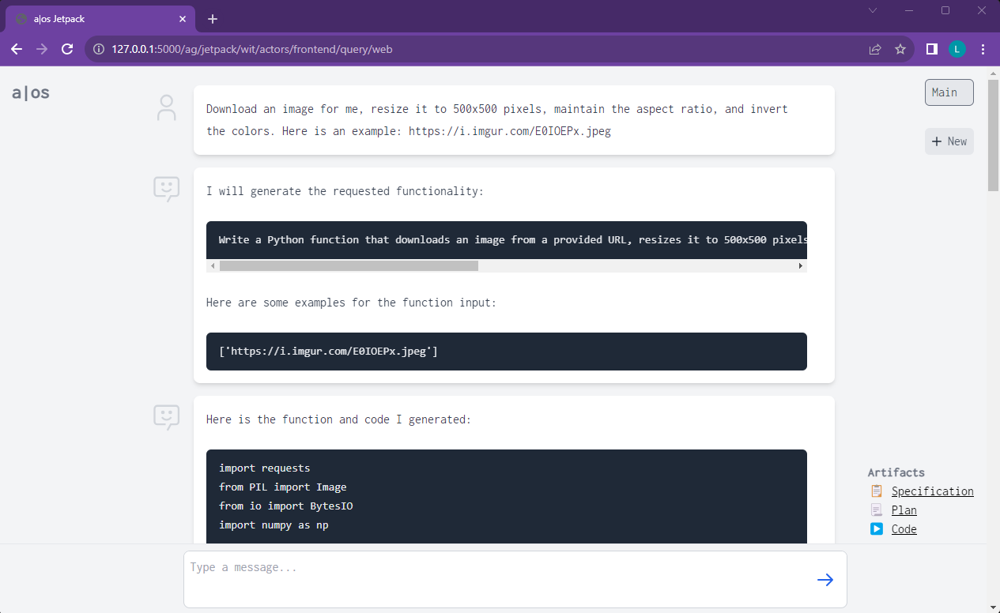

# Agent OS 
🌞 Build autonomous AI agents!

🛠️The Agent OS is an experimental framework and runtime to build sophisticated, long running, and self-coding AI agents.

We believe that the most important super-power of AI agents is to write and execute their own code to interact with the world. But for that to work, they need to run in a suitable environment—a place designed to be inhabited by agents. The Agent OS is designed from the ground up to function as a long-term computing substrate for these kinds of self-evolving agents.

❓If you want to understand the motivation behind the project, read the [manifesto](docs/articles/manifesto.md).  
❓To learn how everything works, start reading the [design docs](docs/design/design.md).

In short:

  - Think of the Agent OS as a *substrate* that is designed for the next generation of robust [Auto-GPTs](https://github.com/Significant-Gravitas/Auto-GPT).
  - The current version is implemented in Python, but the runtime and protocol is designed to work with many different programming languages, and the runtime should eventually be rewritten in a systems language. The current runtime is a prototype (but a serious one).
  - The framework plays well with other AI libraries such as LangChain or LlamaIndex.
  - The system is designed for "[local-first](https://www.inkandswitch.com/local-first/)" agents that run on your machine, but it should also be possible to run parts of an agent in the cloud.
  - The data layer is made for longevity. We introduce a novel data structure that is inspired by Git. It's a content addressable storage that maintains your agent's history and memory and makes sure you never lose data.
  - An agent's primary purpose is not to run large language models on your machine (although that's possible too), but to provide a place to execute the code and functions that are generated by these models. It then composes these functions into larger features and routes events and data to them.
  - To demonstrate the power of the Agent OS, this project comes with a demo agent called ["Jetpack"](agents/README.md#jetpack) that can chat with you and write self-executing programs.


<p><a href="https://www.youtube.com/embed/V8QpNic7b24" target="_blank"></a>
<br>
<small>Click the the image to watch a short demo on YouTube.</small>
</p>


## Getting Started
As long as the project is still in alpha, the best way to get started is to clone this repository.

Requires Python >= 3.10 and [Poetry](https://python-poetry.org/). Works on Linux, macOS, and Windows.

Once cloned, `cd` into the repository and run:
```
poetry install
```

The project comes with a CLI that can be used to initiate and run agents. To see the available commands run:
```
poetry run aos --help
```

## Test Drive an Agent 🤖 
To run your first agent, put an `.env` file in the project root that contains an OpenAI API key. (It also works without an `.env` file or key if you just want to give the project a quick spin.)
```
OPENAI_API_KEY=sk-myspecialkey
```
### Jetpack Agent
The ["Jetpack" agent](agents/README.md) demonstrates what the Agent OS can do and is geared towards end-to-end code generation and execution. It's a conversational agent that can accomplish various tasks for you. To run it, execute the following commands:
```
poetry run aos -d agents/jetpack/ push
poetry run aos -d agents/jetpack/ run
```

Jetpack comes with a web interface, and the Agent OS hosts a web server. To access the interface, browse to http://127.0.0.1:5000/ag/jetpack/wit/actors/frontend/query/web


## Project Structure

* `agents/`: examples of agent implementations. [See the folder](agents/) for more details.
  * `jetpack/`: the flagship agent demo, geared towards conversational task completion through code generation.
* `src/`: contains all relevant modules that are part of the Agent OS.
  * `grit/`: object store, inspired by Git.
  * `wit/`: libraries to help write "wit" state transition functions
  * `runtime/`: the Agent OS runtime: actor executor, custom python module loader, and wit function resolver.
  * `sync/`: modules to push and pull data into grit from the developer's file system.
  * `web/`: the web server that provides the web interface.
  * `cli/`: the "aos" (agent OS) CLI.
* `tests/`: extensive unit tests that cover most of the `/src` packages 
and modules.
* `docs/`: documentation, intended to be rendered as a GitBook.

## Running the Tests
If you want to hack on the code, it is helpful to run the tests. The project uses `pytest` and has almost 100 unit tests.
```
poetry run pytest tests/
```
