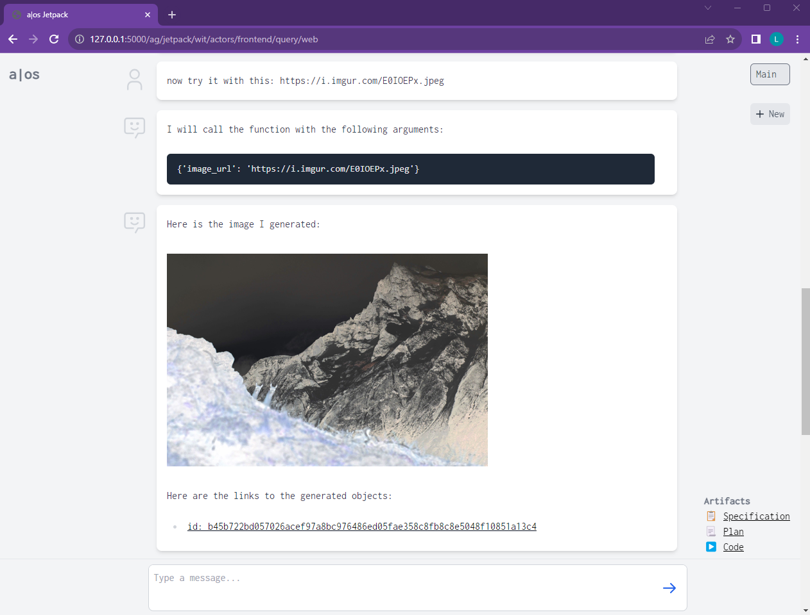

# Agent OS Demos 

While the Agent OS is designed as a platform to build all kinds of agents, we also needs to show how the architecture is realized concretely. This folder contains the Jetpack agent that illustrates how to use the framework and runtime to build a more sophisticated, self-coding agent.

## Folder Structure
- `jetpack/`: the main agent that comes with the Agent OS. Most of the folders inside the `jetpack` directory are implementations of different actors that constitute the agent. See below for more details.
- `demodata/`: a very simple agent that just serves a static website with some data. It can be used as a data source for demoing the Jetpack agent. 
- `lib`: libraries that are used by Jetpack, the code here contains candidates of functionality that might be pushed into the actual Agent OS source code.
- `tests`: unit and integration tests of various agent functionalities, especially Jetpack.

## Jetpack

This agent generates and executes programs for you, just by chatting with  it. 

Jetpack demonstrates the most powerful feature of the Agent OS: the ability to execute code right out of its data store. Code and data live side-by-side, and new data, such as a new chat message, can kick off the writing and updating of code, and vice versa.

It works a bit like "ChatGPT Code Interpreter", but the programs become deployed functions inside the Agent OS, which can later be composed into other larger features and workflows. (However, function composition is not implemented yet).

<p>
</p>

You can just ask the agent what you want it to code and it will do it. The agent will retrieve data if it needs to understand inputs and outputs, then plans the code, then generates the code, then runs some tests against the code, and if the tests pass, deploys it inside Grit, our data store. 

The code can then be invoked by just chatting with an agent.

<p>
</p>

### Using the Agent
Here is a good task to try first. [Start the agent](/README.md#jetpack-agent) and then chat with it in the web interface:
```
Can you download an image for me from the following url: https://i.imgur.com/06lMSD5.jpeg. And then make it grayscale?
```
Once the program is generated you can just invoke it by asking the agent a question:
```
Can you try with this image? https://i.imgur.com/E0IOEPx.jpeg
```
The agent might fail with certain tasks. If that's the case, just start a new chat in the UI or reset the agent via command line (use the `--do-reset` option in the CLI).

### How Jetpack Works
The agent has several coordinating components, called "actors". These actors communicate by sending messages to each other. More on [actors here](/docs/design/design.md#actors).

The [`frontend`](jetpack/frontend/) actor just provides the main UI shell, which is served via the built-in web server of Agent OS. We are using [HTMX](https://htmx.org/) to compose the various HTML components and render them on the server. The frontend [subscribes to new messages](jetpack/templates/index.html) via Server Sent Events (SSE) and updates the UI accordingly. Since the Agent OS comes with a web server, the entire frontend is implemented using simple [wit queries](/docs/design/design.md#wit-queries), for example [here](jetpack/frontend/frontend_queries.py).

The [`chat`](jetpack/chat/) actor encapsulates a single chat history of which there can be several, meaning there can be more than one instance of each chat actor. The agent is structured a bit like ChatGPT, where you can create a new chat with a new context. In Jetpack, each chat has the goal to produce a program and execute it. So the agent will guide you to producing a program, even if you just want to small talk. 

(The goal is that the generated functions in each chat can call each other, but that's not implemented yet.)

Each new chat instantiates and owns a [`retriever` and `coder`](jetpack/coder/). The goal of the coder is to produce, test, deploy, and execute programs. The retriever preprocesses any request to write a program and checks if the task description references any data sources that need to be understood in order to write a correct program. The retriever actually uses another coder to write the code to retrieve that data. Note, the Agent OS is designed for tasks to be solved with code generation all the way down.

For example, I might instruct Jetpack by saying "update the csv sheet at ~/my.csv with the latest sales numbers I give you here." The retriever will then go and inspect how the file `my.csv` looks like so it can write the correct code to achieve the task.

As the agent produces code, plans, executions, and so on, some of the info is printed in the chat stream, but it also adds links on the right side to the produced artifacts so they can be easily referenced and inspected.