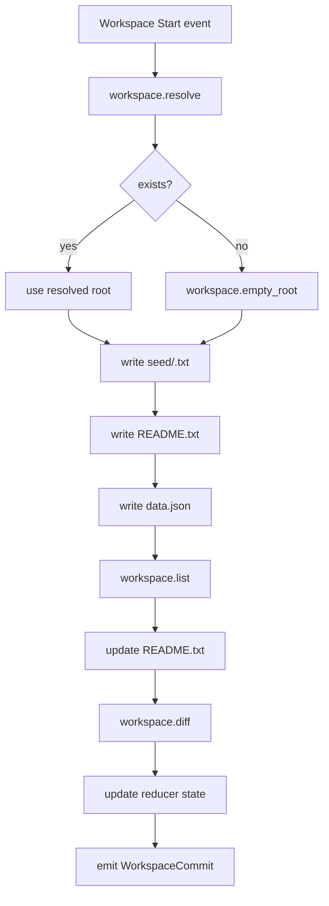

# 09-workspaces

Demonstrates workspace internal effects via a workflow module with capability enforcement.
Seeds one or two workspaces (`alpha`, `beta`), writes files, lists and diffs the tree,
and emits `sys/WorkspaceCommit@1` events.

Workflow flow:

Run:
- `cargo run -p aos-smoke -- workspaces`
- `AOS_WORLD=crates/aos-smoke/fixtures/09-workspaces aos ws ls`

Notes:
- The workflow processes one workspace at a time to keep receipt correlation deterministic.
- Writes include a per-workspace marker (`seed/<workspace>.txt`) to keep seeded trees distinct.
