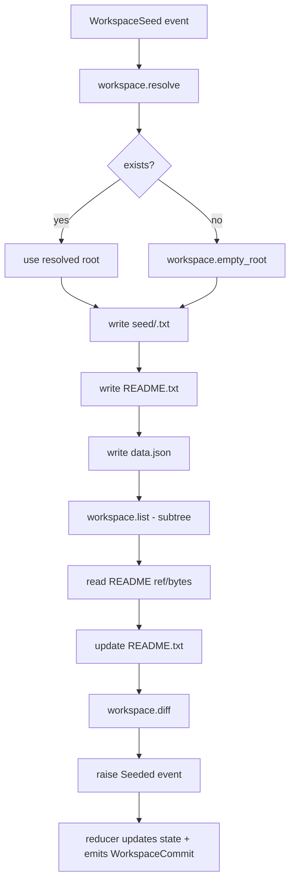

# 09-workspaces

Demonstrates workspace effects via a plan with capability enforcement. Seeds one or two
workspaces (alpha, beta), writes files, lists and diffs the tree, and emits commit events.

Plan flow:

Run:
- `cargo run -p aos-examples -- workspaces`
- `AOS_WORLD=examples/09-workspaces aos ws ls`

Note:
- The plan writes a per-workspace marker file under `seed/` before other writes so effect intents
  remain unique when seeding multiple workspaces in the same world. The reducer also treats
  identical `Seeded` events as idempotent to keep replay deterministic.
- Each `emit_effect` sets `idempotency_key` via `hash({workspace, step})` so retries are stable
  and intent hashes stay unique across parallel workspace seeds.
