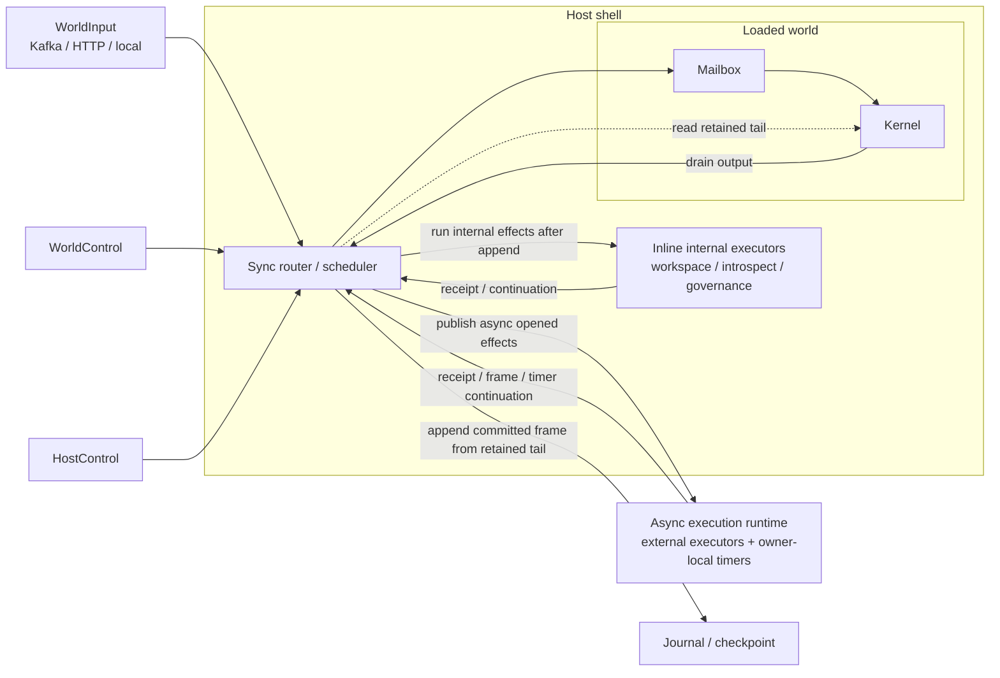
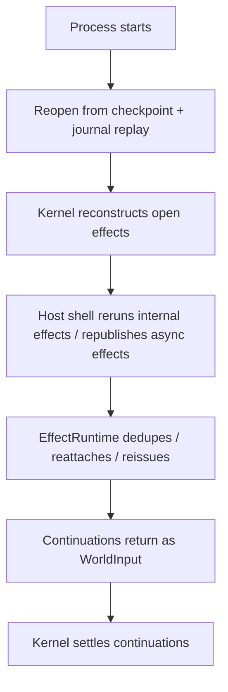

# Execution Architecture

## Goal

Build a runtime with these properties:

- the kernel is single-threaded, deterministic, and fully synchronous,
- the scheduler core that serializes world execution is synchronous too,
- the kernel knows nothing about Tokio or any async runtime,
- ingress and effect handling are async at the edges,
- receipts, stream frames, and timer continuations may arrive at any time and in any order,
- restart correctness comes only from snapshot/checkpoint plus journal replay,
- there is no second durable database for effect execution state.

This note describes the target execution model, not the current implementation shape.
Detailed Tokio task, channel, and thread topology lives in `tokio.md`.

## Hard Rules

- Only the kernel may advance authoritative world state.
- Open work is journaled before external execution may begin.
- `intent_hash` is the durable identity of one open effect within one world.
- Capability and policy are decided once, at effect open time.
- Receipts, stream frames, and timer continuations re-enter only through world admission.
- Runtime execution state is ephemeral and must be reconstructible from kernel state plus substrate state.

Corollary:

- no durable daemon leases,
- no durable attempt table,
- no kernel-level attach or resume protocol,
- no provider session state in authoritative storage.

## Intent Identity

`intent_hash` remains the only owner-side identity for one open effect.

Its construction has two stages:

1. Canonicalize the effect params once.
2. Compute `sha256(cbor(kind, canonical_params, effective_idempotency_key))`.

For non-workflow origins, `effective_idempotency_key` is the explicit supplied key, or the all-zero
key when omitted.

For workflow-origin effects, the kernel first derives that effective idempotency input from stable
origin identity and emission position before hashing.
In architecture terms, that derived input includes:

- origin module identity,
- origin instance key when keyed,
- effect kind,
- canonical params,
- workflow-requested idempotency value,
- effect index within the step,
- emitted sequence.

So `intent_hash` is not a pure content hash of params alone.
It is the per-emission open-effect identity used for pending/open state, continuation routing,
replay, and quiescence.

At host and runtime boundaries, the stable routing key is `(world_id, intent_hash)`.

## Current Mismatch

The codebase is moving in this direction, but the runtime center is still wrong.

Today:

- execution is still centered on `WorldHost` / owner / driver cycle wrappers,
- open effects are still rediscovered by scanning state,
- adapters still look too much like terminal `execute(intent) -> receipt`,
- hosted execution still uses poll/run/sleep supervisors and nested Tokio runtimes,
- hosted commands already take a separate control path even though they share the same transport, which is directionally correct.

That is a workable transition state.
It is not the target architecture.

## Core Model

### 1. Kernel

The kernel is the architectural center.
This is the long-term role of `aos-kernel`.

It is responsible for:

- admitting world input,
- applying world control,
- journaling authoritative state transitions,
- running deterministic workflow progress until idle,
- opening effects,
- settling continuations,
- exposing snapshot and replay.

It must not:

- call async adapters,
- spawn tasks or threads,
- sleep or poll,
- depend on Tokio,
- own provider handles or timer tasks.

The kernel should expose a synchronous API of roughly this shape:

```rust
kernel.accept(message)?;
let drain = kernel.drain_until_idle()?;

drain.opened_effects
drain.kernel_idle
```

The important property is not the exact API.
The important property is that newly-open effects are explicit deterministic output from the kernel.

The kernel should report kernel-visible facts only.
That means:

- newly-open effects,
- whether deterministic workflow progression is idle,
- kernel-visible open-work and continuation state.

It should not claim host-wide or system-wide quiescence.

### 2. Host Shell

The host shell is the minimal effectful shell around one or many kernels.

It is responsible for:

- owning loaded world state and mailboxes,
- serializing access to each kernel,
- routing world input and world control to the right world,
- capturing the retained kernel journal tail for each serialized drain,
- materializing committed world frames from that retained tail,
- durably appending resulting world frames,
- publishing opened effects only after durable append,
- reopening worlds on restart and republishing open effects.

No dedicated `WorldRunner` object is required.
The only invariant is that each loaded world has exactly one serialized driver of its kernel.

That driver may be:

- a direct inline loop,
- a worker scheduler,
- a test harness,
- or some other host-specific shell.

The scheduler core should stay synchronous.
The simplest event-driven model is:

- each `WorldSlot` has one mailbox and one ready bit,
- the host keeps a global FIFO of ready world ids,
- enqueue sets the ready bit and pushes the world id only once,
- the scheduler pops a world id, drains that kernel until kernel-idle, appends any resulting frame,
  runs post-append execution, and
- requeues the world only if more mailbox items arrived meanwhile.

### 3. EffectRuntime

The effect runtime is the async shell for async work.

It is responsible for:

- receiving async opened effects from the host shell,
- routing them to executors,
- ensuring work has started,
- maintaining only ephemeral execution state,
- emitting stream frames and terminal receipts.

The effect runtime must never mutate authoritative world state directly.

Its contract is start-and-report, not dispatch-and-wait.

Conceptually:

- good: `ensure_started(intent)`
- bad: `execute(intent) -> terminal_receipt`

Timers are not a separate architecture.
They are owner-local async execution and may be implemented as one executor inside the shared
runtime shell.

### 3.1 Execution Classes

Not every opened effect goes through the same post-append path.

- Internal deterministic effects such as `workspace.*`, `introspect.*`, and in-world
  `governance.*` execute inline on the scheduler side after durable append.
- Owner-local async execution such as timers may live in the shared runtime shell, but remains
  local to the owning host/scheduler.
- External async execution such as HTTP, LLM, blob, and host/session work is published to the async
  runtime and later returns continuations through `WorldInput`.

### 4. Submission Classes

Three logical classes matter:

- `WorldInput`
  Domain events and external continuations such as receipts, stream frames, and timer completions.
- `WorldControl`
  World-scoped operator control such as governance and admin commands.
- `HostControl`
  Host lifecycle operations such as create, load, evict, and assignment handling.

One physical transport may carry all three.
The logical distinction still matters.

`WorldControl` is not the path for workflow-origin governance effects.
Those are effect intents and, when they are deterministic internal effects, they take the inline
internal-effect path above.

## Authoritative Boundary

Authoritative state lives in:

- durable journal/frame log,
- snapshot/checkpoint,
- reconstructed open-effect state in the kernel.

Ephemeral runtime state lives in:

- task handles,
- timer sleeps,
- network clients,
- provider sessions,
- in-memory routing and bookkeeping.

On restart, ephemeral state is rebuilt.
It is never recovered from a second durable control plane.

## Retained Kernel Journal And Committed Frames

The kernel journal is not itself the durable replay log.
It is an in-memory retained journal tail owned by the loaded world.

The host shell uses that retained tail to materialize durable frames:

1. Record `tail_start` before admitting a mailbox batch or maintenance operation.
2. Admit input or control into the kernel.
3. Drain the kernel until kernel-idle.
4. Read the retained journal tail from `tail_start`.
5. If any entries were produced, build one committed world frame from exactly that suffix.
6. Durably append that frame before any post-append execution begins.

This happens on the scheduler lane that already owns the kernel.
The async runtime never reads kernel journal state and never assembles durable frames.

In the normal event-driven scheduler shape, frame assembly happens once per serialized service of a
ready world.
That one service may consume one mailbox item or several coalesced mailbox items, but it still
produces at most one committed frame before post-append execution runs.

If the kernel appended nothing since `tail_start`, there is no frame to append.

The durable replay source remains:

- checkpoint or snapshot baseline, plus
- durably appended world frames after that baseline.

The retained in-memory journal exists only to support:

- current loaded-world inspection,
- frame assembly before durable append,
- replay helpers while the world is loaded,
- bounded retention between checkpoints.

## Delivery And Recovery

The normal path is push:

- the kernel emits newly-open effects directly,
- the host shell durably appends the resulting world frame,
- the host shell then executes deterministic internal effects inline and publishes async work to
  `EffectRuntime`.

The required recovery path is restart:

- reopen the world from snapshot/checkpoint plus journal replay,
- reconstruct currently-open effects from kernel state,
- re-run deterministic internal effects inline if needed,
- republish async effects to `EffectRuntime`,
- let executors dedupe, reattach, or reissue against the substrate.

No periodic reconcile loop is required.
An explicit repair or republish operation may exist later, but it is optional.

## Kernel Idle And World Quiescence

After a drain, the kernel can honestly report whether deterministic progression is idle and what
kernel-visible open work still exists.

It cannot know whether:

- the host still has queued mailbox items,
- a durable append is still in flight,
- inline post-append work is still being applied,
- async executor work is still pending outside the kernel.

So:

- kernel-idle is a kernel return value,
- world-level quiescence is host-computed from kernel state plus scheduler/runtime state.

Strict apply safety should use that layered definition rather than overloading one kernel return
value with host-wide meaning.

## Checkpoint And Journal Compaction

Checkpoints are serialized host work, not a background shortcut around the scheduler.

A checkpoint for one loaded world follows the same ownership rule as ordinary execution:

1. The scheduler records `tail_start`.
2. The scheduler invokes kernel snapshot creation while it still owns that world.
3. The kernel appends snapshot journal records into the retained in-memory tail.
4. The scheduler reads the retained tail from `tail_start` and builds a checkpoint frame.
5. The host durably appends that frame and advances checkpoint metadata.
6. Only after that durable checkpoint state exists may the retained in-memory journal be compacted
   through the snapshot height.

Normal frame append does not necessarily compact the retained journal.
Compaction advances when a new durable baseline exists, so the retained tail stays bounded between
checkpoints instead of growing without limit.

Checkpoint triggers may be time-based, event-count-based, or explicit administrative actions.
The policy lives in the host shell.
The actual snapshot, frame assembly, durable append, and compaction all stay serialized on the same
scheduler lane that owns the world.

## End-To-End Flow

### WorldInput

1. An ingress edge receives `WorldInput`.
2. The host shell routes it to the correct loaded world.
3. The host shell records `tail_start` for that world.
4. The host shell admits the input into the kernel.
5. The kernel drains until idle and returns drain output.
6. The host shell reads the retained journal tail from `tail_start` and materializes one committed
   world frame when new records exist.
7. The host shell durably appends that frame.
8. The host shell runs inline internal effects and publishes any remaining async opened effects to
   `EffectRuntime`.

### Internal Deterministic Effect

1. The kernel opens an effect and includes it in drain output.
2. After durable append, the host shell executes that effect inline on the scheduler side.
3. The resulting receipt or continuation re-enters through ordinary world admission.
4. The kernel settles the effect.

### Async Effect

1. The kernel opens an effect and includes it in drain output.
2. After durable append, the host shell publishes that open effect to `EffectRuntime`.
3. `EffectRuntime` starts work asynchronously.
4. Later, stream frames, receipts, and timer completions return as `WorldInput`.
5. The host shell admits those continuations into the kernel.
6. The kernel settles the effect.

### Stream Continuations

Stream frames are ordinary `WorldInput` continuations keyed by `(world_id, intent_hash)`.

For one open effect:

- `seq` is monotonic per effect instance,
- duplicate or non-monotonic frames are dropped deterministically,
- gap handling must be explicit and replay-stable,
- frames arriving after terminal settlement are ignored.

### Control

1. `WorldControl` is serialized with the target world and applied through the kernel.
2. `HostControl` is handled by the host shell outside normal world admission.
3. If an operation should be workflow-visible, it should be modeled intentionally as `WorldInput`,
   not smuggled in as control.
4. In-world governance effects take the effect path and, when deterministic/internal, execute inline
   after append rather than through the async runtime.

### Restart

1. Reopen the world from snapshot/checkpoint plus journal replay.
2. Reconstruct currently-open effects from world state.
3. Re-run deterministic internal effects inline and republish async effects to `EffectRuntime`.
4. Executors dedupe, reattach, or reissue against the substrate.
5. Continuations return through normal `WorldInput`.

No kernel attach state machine is required, because effect state is reconstructed from journal.

## Component Model



## Restart Recovery



## Code Direction

- `aos-kernel` should become the explicit architectural center.
- `owner.rs`, `driver.rs`, and cycle wrappers are transitional shell structure, not the target model.
- Open effects should be emitted as explicit drain output, not discovered primarily by scanning state.
- The scheduler should stay synchronous and own per-world serialization directly.
- The adapter contract should move away from terminal execution toward start/stream/finish behavior.
- `intent_hash` should be documented as the per-world effect-instance id derived from canonical
  effect data plus effective idempotency input, not as a bare params hash.
- Deterministic internal effects should bypass the shared async runtime.
- Hosts should model `WorldInput`, `WorldControl`, and `HostControl` explicitly even when one physical transport carries them.
- A dedicated `WorldRunner` type is not required.

## Summary

The target execution architecture is simple:

- a synchronous kernel,
- a synchronous scheduler/host shell that serializes access to each loaded world,
- inline deterministic internal effects plus one async runtime shell for async work and timers,
- explicit logical classes for world input and control,
- restart from snapshot/checkpoint plus journal, with no second durable execution database.
