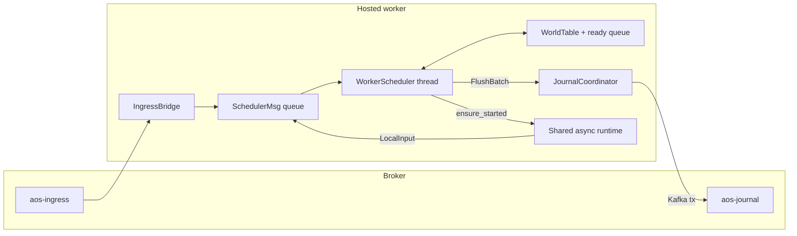
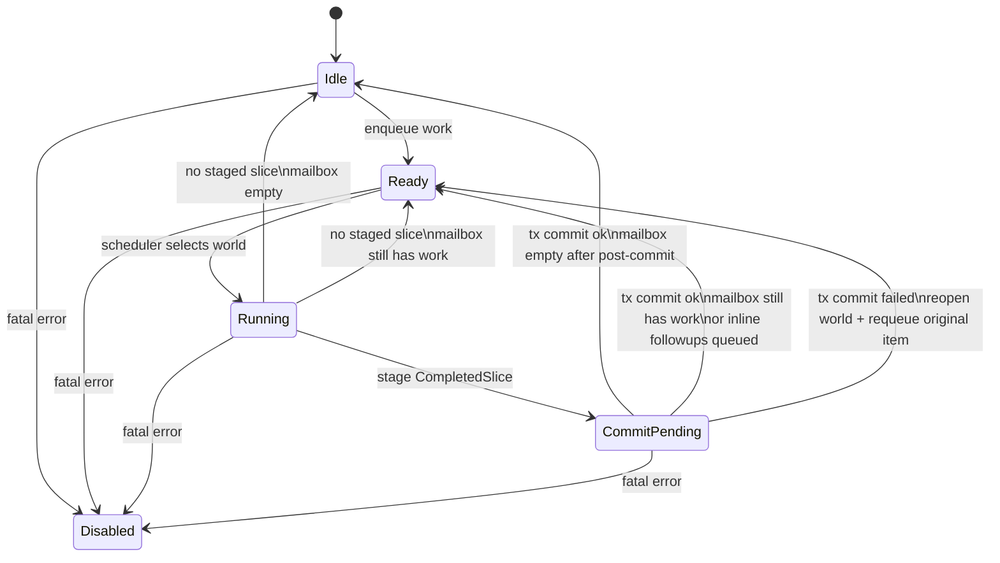
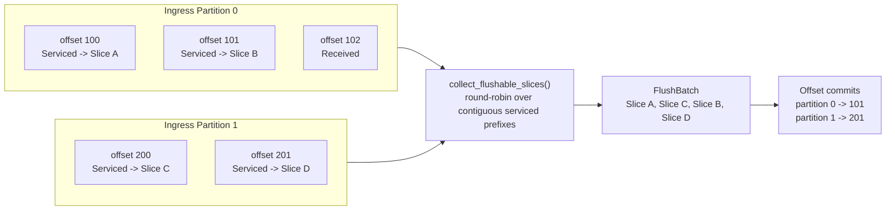
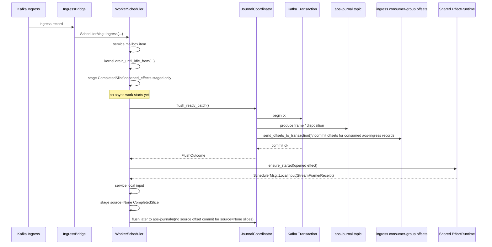

# Hosted Architecture

## Goal

Hosted is the broker-backed realization of `execution-architecture.md`.

The priorities are:

1. simplicity,
2. then performance.

That means the hosted refactor should bias toward a small set of explicit primitives, even if that
temporarily breaks `aos-node`, `aos-node-local`, or `aos-node-hosted` while the core is being cut
over.

The intended end state is:

- one physical ingress topic: `aos-ingress`,
- one authoritative replay log: `aos-journal`,
- many worlds per worker,
- one shared async execution runtime per worker,
- one synchronous scheduler per worker,
- one synchronous kernel per world,
- no per-world Tokio runtime,
- no `WorldHost`/owner/daemon execution center.

Hosted should go as async as practical at the edges, but the append fence and kernel service slice
must stay simple and explicit.

## Relation To Execution Architecture

Hosted is a specialization of `execution-architecture.md`.

- `Kernel` is unchanged.
- The hosted worker is the host shell.
- `WorldInput`, `WorldControl`, and `HostControl` still share one physical ingress topic.
- deterministic internal effects still execute inline after durable append,
- timers are owner-local async execution,
- external effects run in a shared worker-local async runtime,
- `Control` and `Materializer` stay outside the authoritative execution center.

## Refactor Bias

For this hosted cut, prefer these biases:

- cut the hosted core first, then repair outer crates later,
- delete the old execution center rather than wrapping it in more layers,
- keep kernel service semantics simple and explicit,
- batch at the journal fence before batching at kernel admission,
- test `aos-kernel` and the new hosted core first,
- do not preserve partition-shaped execution just because Kafka uses partitions.

The first hosted version does not need to optimize for maximum throughput.
It needs to have the right center.

## Current Hosted Center To Delete

Today the hosted worker still has the wrong center:

- `ActiveWorld` stores `WorldHost`, which still bundles kernel ownership with the old runtime
  shell.
- `WorkerSupervisor -> PartitionWorker -> run_partition_once()` makes partition replay the central
  loop.
- `process_world_until_stable()` spins a fresh current-thread Tokio runtime per world cycle and
  calls `run_owner_execution_cycle()`.
- timers are rehydrated through the old owner/daemon path instead of the new explicit kernel-opened
  effect path.
- `HostedKafkaBackend::drain_partition_submissions()` and
  `HostedKafkaBackend::commit_submission_batch()` bake partition-batch execution into the I/O seam.
- `aos-node-hosted` `all` mode still runs worker and materializer inside `spawn_blocking`
  current-thread runtimes even though the top-level process already has a Tokio runtime.

That shape is transitional.
It should not survive the refactor.

## Hosted Invariants

- `aos-ingress` is transient transport, not replay state.
- restart comes from checkpoint plus `aos-journal`, never from replaying ingress.
- one worker owns the worlds mapped to its assigned ingress partitions.
- each loaded world has exactly one serialized driver of its kernel.
- a frame must be durably appended before opened effects from that frame are published.
- receipts, stream frames, and timer completions re-enter only as `WorldInput`.
- runtime execution state is ephemeral and reconstructed from kernel state plus substrate state.
- command status and projections are read-side state, not authoritative world state.
- the async runtime never writes `aos-journal` directly.
- Kafka source offsets advance only for durably committed contiguous prefixes per ingress
  partition.

## Core Hosted Story

Hosted should be understood as three cooperating layers:

1. `IngressBridge`
   Continuously polls Kafka and parks decoded ingress records in in-memory per-partition buffers.
2. `WorkerScheduler`
   Owns all loaded `WorldSlot`s, serializes kernel access, stages completed service slices, and
   applies post-commit effects.
3. `JournalCoordinator`
   Flushes staged slices into transactional Kafka journal commits and advances ingress offsets only
   for the highest contiguous durable prefix on each ingress partition.

The important point is that these are distinct concerns:

- consume is continuous,
- service is synchronous and world-serialized,
- commit is batched and transactional.

The worker should batch journal commits.
It does not need to batch kernel admission in the first cut.

## Minimal Hosted Primitives

The hosted worker should be rebuilt around a very small set of primitives.

### 1. `SchedulerMsg`

One typed mailbox into the worker scheduler thread.

```rust
enum SchedulerMsg {
    Ingress(IngressRecord),
    LocalInput(LocalInputMsg),
    Assignment(AssignmentDelta),
    FlushTick,
    CheckpointTick,
    Shutdown,
}
```

This is the hosted replacement for the current poll/run/sleep supervisor center.

### 2. `IngressRecord`

One decoded broker record plus the metadata needed for durable acknowledgement.

```rust
struct IngressRecord {
    partition: u32,
    offset: i64,
    envelope: SubmissionEnvelope,
}
```

The worker may classify `envelope` logically as:

- `WorldInput`
- `WorldControl`
- `HostControl`

but the scheduler should receive one uniform ingress record type.

### 3. `LocalInputMsg`

Worker-local async continuations re-enter through the same scheduler, but without a Kafka source
offset.

```rust
struct LocalInputMsg {
    world_id: WorldId,
    input: WorldInput, // receipt, stream frame, timer completion, etc.
}
```

### 4. `WorkItem`

Per-world mailbox entries should normalize ingress-backed and worker-local work into one enum.

```rust
enum WorkItem {
    Ingress {
        token: IngressToken,
        envelope: SubmissionEnvelope,
    },
    LocalInput(WorldInput),
}

struct IngressToken {
    partition: u32,
    offset: i64,
}
```

### 5. `WorldSlot`

Loaded per-world state owned only by the scheduler.

```rust
struct WorldSlot<S: Store + 'static> {
    world_id: WorldId,
    kernel: Kernel<S>,
    world_epoch: u64,
    next_world_seq: u64,
    active_baseline: SnapshotRecord,

    mailbox: VecDeque<WorkItem>,

    ready: bool,
    running: bool,
    commit_blocked: bool,
    pending_slice: Option<SliceId>,

    disabled_reason: Option<String>,
}
```

`WorldSlot` must not own:

- Tokio handles,
- per-world async runtimes,
- `WorldHost`,
- `WorldOwner`,
- adapter registries per world.

### 6. `CompletedSlice`

One completed service slice, staged but not yet durable.

```rust
type SliceId = u64;

struct CompletedSlice {
    id: SliceId,
    world_id: WorldId,
    source: Option<IngressToken>,
    original_item: WorkItem,
    frame: Option<WorldLogFrame>,
    disposition: Option<DurableDisposition>,
    opened_effects: Vec<OpenedEffect>,
    approx_bytes: usize,
}
```

`source` is:

- `Some(...)` for broker ingress-backed work,
- `None` for worker-local continuations such as receipts and stream frames returned by the async
  runtime.

### 7. `DurableDisposition`

Ingress records that produce no world frame still need a durable outcome if their source offset is
to be advanced.

```rust
enum DurableDisposition {
    RejectedSubmission {
        token: IngressToken,
        world_id: WorldId,
        reason: SubmissionRejection,
    },
    CommandFailure {
        token: IngressToken,
        world_id: WorldId,
        command_id: String,
        error_code: String,
    },
}
```

The exact representation may change.
The important invariant is that a no-frame ingress item must still have a durable Kafka-side
consequence before its offset may advance.

## Worker Topology

Hosted should have one worker-local execution center:

- one process Tokio runtime,
- one ingress bridge,
- one scheduler thread,
- one world table,
- one shared async effect/timer runtime,
- one journal coordinator.

Notably absent:

- no partition supervisors,
- no per-world Tokio runtimes,
- no nested current-thread runtimes,
- no `run_owner_execution_cycle()`.



## Scheduler Loop

The scheduler loop should be structurally simple:

```rust
loop {
    drain_scheduler_msgs();
    while let Some(world_id) = ready_worlds.pop_front() {
        if !world_is_serviceable(world_id) {
            continue;
        }
        service_one_world(world_id)?;
    }
    if flush_due() {
        if let Some(outcome) = journal.flush_ready_batch(limits)? {
            finalize_flush_success(outcome)?;
        }
    }
}
```

`world_is_serviceable(world_id)` means:

```rust
!slot.disabled()
&& !slot.running
&& !slot.commit_blocked
&& !slot.mailbox.is_empty()
```

## Per-World State Machine

The loaded-world execution state should stay small.

### States

- `Idle`
  `mailbox.is_empty() && !running && !commit_blocked && !disabled`
- `Ready`
  `!mailbox.is_empty() && !running && !commit_blocked && !disabled`
- `Running`
  the scheduler is servicing one mailbox item
- `CommitPending`
  one completed slice has been staged and is waiting for Kafka transaction outcome
- `Disabled`
  fatal unrecoverable world-local failure

### Transitions

- `Idle -> Ready`
  when any mailbox item is enqueued
- `Ready -> Running`
  when the scheduler selects the world
- `Running -> Idle`
  when the item produced no staged slice and the mailbox is empty
- `Running -> Ready`
  when the item produced no staged slice and the mailbox still has work
- `Running -> CommitPending`
  when the item produced a staged `CompletedSlice`
- `CommitPending -> Idle`
  when transaction commit succeeds and the mailbox is empty after post-commit work
- `CommitPending -> Ready`
  when transaction commit succeeds and the mailbox still has work, or inline post-commit followups
  were enqueued
- `CommitPending -> Ready`
  when transaction commit fails, the world is reopened from durable state, and the original item is
  requeued
- `any -> Disabled`
  on fatal unrecoverable world-local failure

### Critical Rule: One Uncommitted Slice Per World

The first hosted cut should allow at most one uncommitted slice per world.

That means:

- `WorldSlot.commit_blocked == true` blocks further service for that world,
- batching happens across many worlds,
- same-world speculative pipelining is intentionally disallowed.

This is important because it preserves ordering between:

- ingress items,
- inline post-commit internal effects,
- receipts and stream frames emitted by async work opened in earlier committed slices.

The throughput story should come from:

- continuous Kafka prefetch,
- many worlds multiplexed on one scheduler,
- batched journal transactions,

not from allowing multiple uncommitted same-world slices.

### State Diagram



## Mailbox Ordering

Use one per-world mailbox with three enqueue modes:

- broker ingress appends to the back,
- async runtime local inputs append to the back,
- inline post-commit followups push to the front.

Conceptually:

```rust
fn enqueue_ingress(slot: &mut WorldSlot, item: WorkItem) {
    slot.mailbox.push_back(item);
}

fn enqueue_local_input(slot: &mut WorldSlot, input: WorldInput) {
    slot.mailbox.push_back(WorkItem::LocalInput(input));
}

fn enqueue_inline_followup(slot: &mut WorldSlot, input: WorldInput) {
    slot.mailbox.push_front(WorkItem::LocalInput(input));
}
```

This preserves the local semantic: immediate inline consequences of a committed slice should run
before later queued ingress for that same world.

## Ingress Consumption

Kafka consume and journal coordination is the main hosted-specific problem that local does not
have.

The solution is:

- continuous Kafka consume into in-memory per-partition pending buffers,
- synchronous world service slices,
- batched transactional journal commit,
- source offset advancement only for contiguous serviced prefixes per ingress partition.

### `IngressBridge`

The Kafka consumer should remain a normal continuous poll loop.
Round-robin is for batch collection, not for Kafka polling.

Conceptually:

```rust
struct PendingIngressEntry {
    token: IngressToken,
    state: PendingState,
}

enum PendingState {
    Received,
    Serviced(SliceId),
}

struct PendingPartition {
    entries: VecDeque<PendingIngressEntry>,
}
```

The bridge continuously polls Kafka and parks ingress records into `pending_by_partition`:

```rust
loop {
    let message = consumer.poll(...)?;
    let record = decode_ingress_record(message)?;
    pending_by_partition[record.partition].push_back(PendingIngressEntry {
        token: IngressToken {
            partition: record.partition,
            offset: record.offset,
        },
        state: PendingState::Received,
    });
    scheduler_tx.send(SchedulerMsg::Ingress(record))?;
}
```

### Backpressure

The bridge should support bounded read-ahead:

- allow continuous polling under healthy load,
- cap in-memory backlog per partition,
- `pause()` Kafka partitions whose pending backlog exceeds the cap,
- `resume()` once enough of the contiguous prefix has committed.

Consume cadence and flush cadence are separate concerns:

- consume is continuous,
- flush happens on `max_slices`, `max_bytes`, or `max_delay`.

## Service Slice

The scheduler owns the only mutable access to each world's kernel.

For one mailbox item, the hosted service slice is:

1. dequeue one mailbox item for one world,
2. record `tail_start = kernel.journal_head()`,
3. apply either `Kernel::accept()` or `Kernel::apply_control()`,
4. call `kernel.drain_until_idle_from(tail_start)`,
5. materialize at most one `WorldLogFrame` from `KernelDrain.tail`,
6. stage one `CompletedSlice`,
7. do not start any opened effects yet,
8. let the journal coordinator flush it later,
9. only after durable commit, run inline internal effects and submit timers/external async work,
10. if the world mailbox is still non-empty after post-commit work, mark the world ready again.

That is the entire hosted execution center.

No hidden second loop should rediscover open work by scanning world state.
The scheduler already has the opened effects in `KernelDrain`.

### Service API

The scheduler-side service API should look roughly like this:

```rust
fn service_one_world(&mut self, world_id: WorldId) -> Result<Option<SliceId>, WorkerError>;
fn stage_completed_slice(&mut self, slice: CompletedSlice);
```

And the world service itself:

```rust
fn service_one_world(&mut self, world_id: WorldId) -> Result<Option<SliceId>, WorkerError> {
    let item = pop_mailbox_item(world_id)?;
    let tail_start = kernel(world_id).journal_head();

    match &item {
        WorkItem::Ingress { envelope, .. } => match classify_submission(envelope) {
            SubmissionClass::WorldInput(input) => kernel_mut(world_id).accept(input.clone())?,
            SubmissionClass::WorldControl(control) => {
                let _ = kernel_mut(world_id).apply_control(control.clone())?;
            }
            SubmissionClass::HostControl(_) => unreachable!("host control bypasses world service"),
        },
        WorkItem::LocalInput(input) => kernel_mut(world_id).accept(input.clone())?,
    }

    let drain = kernel_mut(world_id).drain_until_idle_from(tail_start)?;
    let slice = build_completed_slice(world_id, item, drain)?;
    stage_completed_slice(slice);
    Ok(Some(slice.id))
}
```

## Commit Fence

Hosted needs one explicit durable fence primitive at the worker I/O boundary.

Conceptually:

```rust
struct FlushLimits {
    max_slices: usize,
    max_bytes: usize,
    max_delay: Duration,
}

struct FlushBatch {
    slice_ids: Vec<SliceId>,
    frames: Vec<WorldLogFrame>,
    dispositions: Vec<DurableDisposition>,
    offset_commits: BTreeMap<u32, i64>,
    bytes: usize,
}

struct FlushOutcome {
    committed_slices: Vec<CompletedSlice>,
    committed_offsets: BTreeMap<u32, i64>,
}
```

The commit fence is:

- journal append when a frame exists,
- durable disposition when no frame exists,
- ingress offset advancement for the highest contiguous durable prefix,
- all in one Kafka transaction.

## Batching Model

The throughput-preserving hosted model is:

- large continuous ingress batches into memory,
- per-record scheduler service slices,
- batched transactional journal commit.

The first hosted cut should **not** batch multiple ingress records into one kernel admission step.
That is a later optimization if profiling says kernel-entry overhead is the bottleneck.

The first hosted cut should batch at the journal fence, not at the kernel boundary.

### Why

Batching at the journal fence preserves semantics:

- one mailbox item still corresponds to one deterministic kernel service slice,
- many completed slices can share one Kafka transaction,
- one transaction may commit offsets for many ingress partitions and append frames for many worlds.

### Important Rule

Never acknowledge a consumed Kafka record unless the same transaction includes a durable Kafka-side
consequence for that record.

That durable consequence is:

- a `WorldLogFrame`, or
- a `DurableDisposition`.

### Batching Diagram

The collector batches already-serviced slices, not raw Kafka messages.



In this example:

- partition `0` may commit through offset `101`,
- partition `0` may not commit `102` because it is only `Received`,
- partition `1` may commit through offset `201`,
- the transaction may still contain slices from both partitions.

## `collect_flushable_slices()`

The collector builds the biggest safe Kafka transaction from already-serviced slices.

It must:

- consider already-staged slices only,
- commit source offsets only for the longest contiguous serviced prefix per ingress partition,
- avoid starvation by walking partitions in round-robin order,
- optionally include source-less local continuation slices in the same transaction.

Round-robin is for batch selection only.
It is not a Kafka poll strategy.

### Collector State

```rust
struct SchedulerState {
    pending_by_partition: BTreeMap<u32, VecDeque<PendingIngressEntry>>,
    staged_slices: BTreeMap<SliceId, CompletedSlice>,
    local_ready_slices: VecDeque<SliceId>, // source == None
    flush_rr_cursor: usize,
}
```

### Collector Algorithm

1. derive a partition iteration order from `flush_rr_cursor`,
2. for each partition, inspect only the contiguous serviced prefix from the front of that
   partition's pending deque,
3. add at most one more slice per partition per round,
4. stop on `max_slices`, `max_bytes`, or `max_delay`,
5. after source-backed slices, optionally add source-less local slices,
6. build one `FlushBatch`.

### Pseudocode

```rust
fn collect_flushable_slices(&self, limits: FlushLimits) -> Option<FlushBatch> {
    let mut batch = FlushBatch {
        slice_ids: Vec::new(),
        frames: Vec::new(),
        dispositions: Vec::new(),
        offset_commits: BTreeMap::new(),
        bytes: 0,
    };

    let partitions = partition_order_from(self.flush_rr_cursor);
    let mut scan_idx: BTreeMap<u32, usize> = BTreeMap::new();

    loop {
        let mut progressed = false;

        for partition in &partitions {
            let idx = scan_idx.entry(*partition).or_insert(0);
            let Some(entry) = self.pending_by_partition[partition].get(*idx) else {
                continue;
            };

            let PendingState::Serviced(slice_id) = entry.state else {
                continue;
            };

            let slice = &self.staged_slices[&slice_id];
            if !fits(&batch, slice, &limits) {
                return (!batch.slice_ids.is_empty()).then_some(batch);
            }

            push_slice(&mut batch, slice);
            batch.offset_commits.insert(*partition, entry.token.offset);
            *idx += 1;
            progressed = true;
        }

        if !progressed {
            break;
        }
    }

    while let Some(slice_id) = self.local_ready_slices.front().copied() {
        let slice = &self.staged_slices[&slice_id];
        if !fits(&batch, slice, &limits) {
            break;
        }
        push_slice(&mut batch, slice);
        break;
    }

    (!batch.slice_ids.is_empty()).then_some(batch)
}
```

The collector does not care whether a `CompletedSlice` came from:

- one ingress record,
- many same-world consecutive ingress records in a future micro-batched design,
- or one local continuation.

It only cares about:

- staged slice identity,
- contiguous source-backed prefixes,
- flush limits.

## Journal Coordinator

The journal coordinator should expose one focused API:

```rust
trait JournalCoordinator {
    fn flush_ready_batch(
        &mut self,
        limits: FlushLimits,
    ) -> Result<Option<FlushOutcome>, JournalError>;
}
```

And the implementation shape:

```rust
fn flush_ready_batch(&mut self, limits: FlushLimits) -> Result<Option<FlushOutcome>, JournalError> {
    let Some(batch) = self.collect_flushable_slices(limits) else {
        return Ok(None);
    };

    begin_kafka_tx()?;

    for frame in &batch.frames {
        produce_to_journal(frame)?;
    }
    for disposition in &batch.dispositions {
        produce_disposition(disposition)?;
    }

    send_offsets_to_transaction(&batch.offset_commits)?;
    commit_kafka_tx()?;

    Ok(Some(FlushOutcome {
        committed_slices: take_slices(batch.slice_ids),
        committed_offsets: batch.offset_commits,
    }))
}
```

### Kafka Transaction Shape

One transaction may:

- append frames for many worlds,
- write durable dispositions for no-frame ingress outcomes,
- commit source offsets for many ingress partitions.

Important clarification:

- journal frames and dispositions are produced to `aos-journal`,
- source offsets are **not** produced to `aos-journal`,
- source offsets are **not** produced to `aos-ingress`,
- instead, the transaction atomically commits consumer-group offsets for records previously
  consumed from `aos-ingress`.

This is the target shape.
The current partition-bound transactional producer setup is an artifact of the partition-centered
worker, not the desired final execution center.

## Post-Commit Execution

Opened effects are not submitted when the kernel opens them.
They are submitted only after the slice that opened them has committed.

The lifecycle is:

- `opened`
  kernel emitted the effect in `KernelDrain.opened_effects`
- `staged`
  scheduler stored it in `CompletedSlice.opened_effects`
- `committed`
  the slice was included in a successful Kafka transaction
- `submitted`
  scheduler post-commit logic handed it to inline execution, timer runtime, or external async
  runtime

### Post-Commit API

```rust
fn finalize_flush_success(&mut self, outcome: FlushOutcome) -> Result<(), WorkerError>;
fn apply_post_commit(&mut self, slice: CompletedSlice) -> Result<(), WorkerError>;
```

And:

```rust
fn finalize_flush_success(&mut self, outcome: FlushOutcome) -> Result<(), WorkerError> {
    for (partition, last_offset) in outcome.committed_offsets {
        drop_committed_pending_prefix(partition, last_offset);
    }

    for slice in outcome.committed_slices {
        clear_world_commit_barrier(slice.world_id, slice.id)?;
        apply_post_commit(slice)?;
    }

    Ok(())
}
```

`apply_post_commit(slice)` should:

- run inline internal effects immediately on the scheduler,
- enqueue their resulting followup `WorldInput`s at the front of the world mailbox,
- submit timers to the shared timer runtime,
- submit external effects to the shared async effect runtime.

### Post-Commit Classification

```rust
fn apply_post_commit(&mut self, slice: CompletedSlice) -> Result<(), WorkerError> {
    for opened in slice.opened_effects {
        match classify(&opened.intent) {
            EffectExecutionClass::InlineInternal => {
                if let Some(receipt) = kernel_mut(slice.world_id).handle_internal_intent(&opened.intent)? {
                    enqueue_inline_followup(slice.world_id, WorldInput::Receipt(receipt));
                }
            }
            EffectExecutionClass::OwnerLocalTimer => {
                let _ = timer_runtime.ensure_started(slice.world_id, opened.intent)?;
            }
            EffectExecutionClass::ExternalAsync => {
                let _ = effect_runtime.ensure_started(slice.world_id, opened.intent)?;
            }
        }
    }

    mark_world_ready_if_needed(slice.world_id)?;
    Ok(())
}
```

## Async Effect Runtime

The effect runtime is fully async.
It just is not authoritative.

### API

```rust
enum EnsureStarted {
    Started,
    AlreadyRunning,
}

trait EffectRuntime {
    fn ensure_started(
        &self,
        world_id: WorldId,
        intent: EffectIntent,
    ) -> Result<EnsureStarted, EffectRuntimeError>;
}
```

Contract:

- call it only after the opening slice has committed,
- it may spawn Tokio tasks internally,
- it must never write `aos-journal`,
- it must never mutate kernel state,
- it must report updates by sending `SchedulerMsg::LocalInput`.

### Returned Updates

The async runtime may produce:

- `EffectStreamFrame`
- `EffectReceipt`

Internally:

```rust
enum EffectUpdate {
    StreamFrame(EffectStreamFrame),
    Receipt(EffectReceipt),
}
```

And re-entry:

```rust
fn on_effect_update(
    world_id: WorldId,
    update: EffectUpdate,
    scheduler_tx: &Sender<SchedulerMsg>,
) {
    let input = match update {
        EffectUpdate::StreamFrame(frame) => WorldInput::StreamFrame(frame),
        EffectUpdate::Receipt(receipt) => WorldInput::Receipt(receipt),
    };

    let _ = scheduler_tx.send(SchedulerMsg::LocalInput(LocalInputMsg {
        world_id,
        input,
    }));
}
```

### Critical Boundary

Receipts and stream frames are **not** written to `aos-journal` by the async runtime.

They become journaled only by the normal scheduler path:

1. async runtime emits `SchedulerMsg::LocalInput`,
2. scheduler enqueues it into the target world mailbox,
3. scheduler services that mailbox item with `kernel.accept(...)`,
4. scheduler stages a new `CompletedSlice { source: None, ... }`,
5. journal coordinator flushes that slice to `aos-journal`.

So the async runtime is transport only.
The scheduler remains the only gateway into authoritative state.

### Effect Continuation Diagram



## Source-Backed And Source-Less Slices

The scheduler stages two kinds of slices:

- source-backed slices
  produced from broker ingress, with `source: Some(IngressToken)`
- source-less slices
  produced from worker-local continuations, with `source: None`

Both may be included in one Kafka transaction.

Only source-backed slices affect ingress offset advancement.

This is the critical distinction that allows:

- transactional batching across broker ingress and local async continuations,
- while still preserving exact source-offset correctness.

## Failure Handling

If Kafka transaction commit fails:

- do not publish effects,
- do not release source offsets,
- reopen any touched worlds from durable checkpoint plus `aos-journal`,
- clear `commit_blocked`,
- requeue the original `WorkItem` from each failed slice at the front of the corresponding world
  mailbox,
- mark those worlds ready again.

That is why `CompletedSlice` retains `original_item`.

Conceptually:

```rust
fn handle_flush_failure(failed_slices: Vec<CompletedSlice>) -> Result<(), WorkerError> {
    for slice in failed_slices {
        reopen_world_from_durable_state(slice.world_id)?;
        clear_world_commit_barrier(slice.world_id, slice.id)?;
        requeue_front(slice.world_id, slice.original_item);
        mark_world_ready(slice.world_id)?;
    }
    Ok(())
}
```

If the process crashes after the effect runtime emitted an update but before that update's
source-less slice commits, that update is not durable yet.
On restart:

- the world is reopened from `aos-journal`,
- the effect is still open in kernel state if it was not settled durably,
- the async runtime reattaches, dedupes, or reissues against the substrate,
- duplicate receipts/frames are tolerated by kernel intent identity and stream sequencing rules.

## `HostControl`

`CreateWorld` and other host lifecycle operations stay outside normal world admission.

For hosted:

1. `HostControl` arrives on `aos-ingress`,
2. the scheduler handles it directly,
3. it may create or load a `WorldSlot`,
4. it may append an initial frame,
5. it may emit a durable no-frame disposition instead,
6. it commits the ingress offset only after the create outcome is durable.

`HostControl` is not a fake world input and should not be forced through kernel admission just to
reuse old plumbing.

## Restart And Rehydration

On restart or assignment gain:

1. load world registration from checkpoint plus `aos-journal`,
2. reopen the kernel from checkpoint plus journal replay,
3. reconstruct pending open effects from kernel state,
4. rehydrate pending timers from kernel state,
5. republish external async effects to the shared runtime,
6. continue admitting new `WorldInput`.

There is no separate durable attempt table, lease table, or provider session database.

## Checkpointing

Checkpoint creation still serializes on the scheduler thread.

For one world:

1. record `tail_start`,
2. call `kernel.create_snapshot()`,
3. materialize a checkpoint frame from the retained tail,
4. stage a source-less `CompletedSlice`,
5. flush it through the journal coordinator,
6. only after durable commit, compact the retained journal through the new durable baseline.

Checkpoint policy may be time-based or event-based, but checkpoint execution is just another
scheduler-side service slice.

## Tokio Topology

Hosted should use Tokio at the edges, not at the execution center.

Hosted Tokio owns:

- control HTTP tasks,
- Kafka ingress polling / bridge tasks,
- shared external effect tasks,
- shared timer sleeps,
- materializer consumer tasks.

Hosted Tokio does not own:

- per-world serialization,
- kernel mutation,
- frame boundaries,
- append ordering.

The worker scheduler remains a synchronous thread with a typed mailbox.

Detailed local-vs-hosted Tokio notes live in [tokio.md](/Users/lukas/dev/aos/roadmap/v0.18-execution/architecture/tokio.md).

## Refactor Sequence

The hosted refactor should happen in this order:

1. Delete the old hosted execution center from the design.
   Stop treating `WorldHost`, `run_owner_execution_cycle()`, and partition supervisors as assets.
2. Build the new hosted core around:
   - `Kernel`
   - `WorldSlot`
   - `SchedulerMsg`
   - world mailbox + ready queue
   - `CompletedSlice`
   - one uncommitted slice per world
3. Replace partition-batch broker APIs with:
   - continuous ingress buffering
   - staged slices
   - batched transactional flush over contiguous serviced prefixes
4. Reintroduce shared async effect execution and shared timer execution around that scheduler.
5. Rebuild checkpointing and restart on top of the new worker core.
6. Only then repair control, materializer, local node, and any remaining compatibility layers.

During this sequence it is acceptable for outer crates to be broken.
The important thing is that the new kernel/worker core is correct.

## Summary

The hosted worker should become:

- one ingress bridge continuously polling Kafka into per-partition buffers,
- one scheduler thread,
- one `WorldSlot` table with mailbox + ready bit,
- one uncommitted slice max per world,
- one shared async effect/timer runtime,
- one staged `CompletedSlice` model,
- one batched transactional journal flush over contiguous serviced prefixes,
- one explicit rule that effects are submitted only after their opening slice commits,
- one authoritative journal,
- no partition-supervisor execution center,
- no per-world runtime objects,
- no hidden daemon loop.
