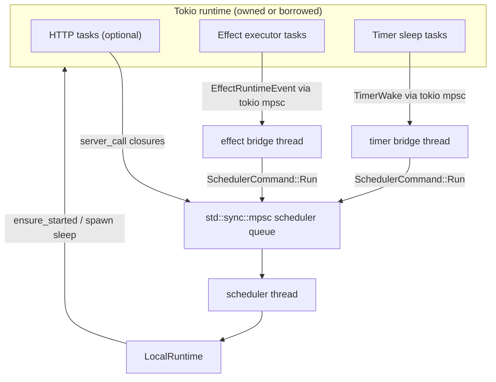
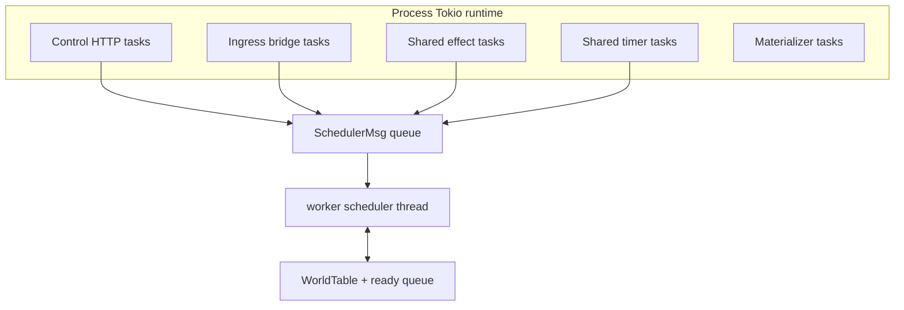

# Tokio Topology

## Goal

This note describes:

- the local/embedded Tokio and thread topology as implemented today, and
- the hosted Tokio topology we are aiming for during the v0.18 refactor.

The architecture is still defined by:

- `Kernel`
- `LocalRuntime`
- `WorldSlot`
- `LocalControl`

Tokio is only the async substrate around that architecture.

## Design Rules

- The kernel stays fully synchronous and knows nothing about Tokio.
- Durable append still happens before opened async effects are published.
- Serialized world progression is owned outside the Tokio executor.
- Direct mode remains first-class and must not be forced through server-only coordination.
- Tokio types are implementation details; the important boundaries are ownership and message flow.

## Implemented Local Components

The current local implementation uses four distinct coordination layers:

### `EdgeRuntime`

`EdgeRuntime` is the Tokio edge substrate used by `LocalRuntime`.

It is either:

- an owned multithread Tokio runtime created by `LocalRuntime::open()`
- or a borrowed `tokio::runtime::Handle` passed to `LocalRuntime::open_with_handle()`

The owned runtime currently uses:

- `tokio::runtime::Builder::new_multi_thread()`
- `worker_threads(1)`
- `enable_all()`

### Server Scheduler Lane

In server mode, `LocalControl` creates:

- `std::sync::mpsc::Sender<SchedulerCommand>`
- one scheduler thread that executes `SchedulerCommand::Run(SchedulerJob)`

The scheduler queue currently carries closure jobs, not a typed `SchedulerMsg` enum.

### Runtime Mailboxes

Inside `LocalRuntime`, each `WorldSlot` has:

- one mailbox: `VecDeque<SubmissionEnvelope>`
- one ready bit

The runtime keeps:

- `ready_worlds: VecDeque<WorldId>`

That mailbox/ready-queue structure is the real local scheduling core.

### Async Continuation Lanes

Async continuations currently use Tokio `mpsc` channels:

- `effect_event_tx/effect_event_rx` for `EffectRuntimeEvent<WorldId>`
- `timer_wake_tx/timer_wake_rx` for `TimerWake`

These channels are drained differently in server and direct mode.

## Server Mode Topology

Server mode is used by:

- `aos-node-local serve`
- `LocalControl::open()`
- `LocalControl::open_with_handle()`

There are two variants:

- `aos-node-local serve`
  Builds the process Tokio runtime in `main()` and passes its handle into
  `LocalControl::open_with_handle()`.
- library/server embedding via `LocalControl::open()`
  Lets `LocalRuntime` create and own its own edge runtime.

In both cases, the topology is the same:

- Tokio hosts HTTP tasks when present
- Tokio hosts external effect execution
- Tokio hosts timer sleeps
- a scheduler thread serializes runtime mutations
- an effect bridge thread blocks on the effect continuation receiver and forwards work to the
  scheduler thread
- a timer bridge thread blocks on the timer wake receiver and forwards work to the scheduler
  thread

### What The Scheduler Thread Actually Does

The scheduler thread does not own a special scheduler object.
It executes closure jobs against the shared `Arc<LocalRuntime>`.

Those jobs typically:

1. enqueue a submission or continuation into a world mailbox
2. call `process_all_pending()`
3. wait for the runtime result and send it back over a sync reply channel

That means local HTTP control is async at the transport edge but synchronous with respect to the
world transition it triggered.

For example:

- `enqueue_event()`
- `enqueue_receipt()`
- `submit_command()`
- `create_world()`
- `fork_world()`

all complete only after the scheduler thread has run the relevant local work.

## Direct / Batch / Harness Mode

Direct mode is used by:

- `LocalControl::open_batch()`
- `aos-node-local batch`
- `EmbeddedWorldHarness`

Direct mode does not spawn:

- a scheduler thread
- an effect bridge thread
- a timer bridge thread

Instead:

- the caller thread invokes `LocalRuntime` directly
- the runtime still owns an internal Tokio edge runtime for effect execution and timer sleeps
- continuation channels are drained by `process_all_pending()` via `try_recv()`

This is why direct mode is still not defined by Tokio topology.
Tokio is present, but only to host async edges.

### Direct-Mode Catch-Up

The current direct-mode pattern is:

- mutating operations such as `create_world`, `fork_world`, `submit_command`, `enqueue_event`,
  and `enqueue_receipt` already call `process_all_pending()`
- read APIs generally do not pump async continuation queues
- `step_world()` is the explicit catch-up hook that calls `process_all_pending()` and then returns
  the requested world's summary

`step_world()` currently drains the whole runtime, not just one world's mailbox.

## The Real Local Message Boundaries

The current local implementation does not use the notional `SchedulerMsg` / `EffectCmd` split from
the earlier design note.

The actual boundaries are:

### Scheduler Queue

- `SchedulerCommand::Run(SchedulerJob)` on `std::sync::mpsc`

This is server-mode only.

### Per-World Submission Queue

- `SubmissionEnvelope` in each `WorldSlot.mailbox`

This is where domain events, receipts, commands, and create/fork-derived work are normalized for
runtime processing.

### Continuation Channels

- `EffectRuntimeEvent::WorldInput`
- `TimerWake`

These are the Tokio-backed async return lanes.

## Durable Append Boundary

The local async topology still has a clean synchronous append seam.

For one input or command step, `LocalRuntime`:

1. records `tail_start = kernel.journal_head()`
2. applies input or governance control
3. calls `kernel.drain_until_idle_from(tail_start)`
4. builds one `WorldLogFrame` from `KernelDrain.tail` when entries exist
5. appends that frame inline to SQLite
6. updates runtime counters and checkpoint-head metadata
7. compacts the retained in-memory journal through the active baseline height
8. classifies opened effects into inline internal, owner-local timer, or external async work

Only after step 5 does it publish async work.

## How Async Work Re-Enters

### External Effects

External effects are started with:

- `EffectRuntime::ensure_started()`

The effect runtime later emits:

- `EffectRuntimeEvent::WorldInput`

That event is:

- forwarded by the effect bridge thread in server mode
- or drained by `process_all_pending()` in direct mode

It is then converted back into `SubmissionEnvelope` and requeued into the target world mailbox.

### Timers

Owner-local timers are:

- tracked in `TimerScheduler`
- deduped with `scheduled_timers`
- backed by `tokio::time::sleep_until()`

When a sleep fires, the runtime sends `TimerWake`.
That wake is converted into synthetic timer receipts and requeued as normal world input.

## What Tokio Owns

Tokio owns:

- HTTP serving when present
- effect executor tasks
- timer sleeps
- the process-owned edge runtime in non-server embedding and batch/direct mode

Tokio does not own:

- the kernel
- frame boundaries
- durable append ordering
- world mailbox scheduling
- per-world serialization

## What The Current Code No Longer Does

The current local implementation no longer uses the older transition-state shape described in the
previous doc revision.

It now has:

- no `LocalSupervisor` poll/sleep loop
- no `LocalWorker`
- no nested per-world Tokio runtime
- no per-world current-thread runtime ownership model
- no separate journal-writer task

The scheduler is now a simple thread + closure queue in server mode, and inline calls in direct
mode.

## Hosted Target Topology

Hosted should use Tokio more heavily than local, but only at the edges.

Target hosted shape:

- one process-owned multithread Tokio runtime,
- one ingress bridge task (or small set of tasks) polling Kafka and forwarding typed
  `SchedulerMsg`s,
- one shared async effect runtime for external executors,
- one shared timer execution lane using Tokio sleeps,
- one materializer consumer lane,
- one synchronous worker scheduler thread owning all loaded `WorldSlot`s.

Hosted must not have:

- per-world Tokio runtimes,
- per-world current-thread runtimes,
- nested `spawn_blocking` + `new_current_thread()` shells for the worker center,
- Tokio tasks mutating kernels directly.

The hosted worker scheduler should observe a topology like this:

The important boundary is:

- Tokio produces ingress and continuation messages,
- the scheduler thread owns world serialization and append ordering.

Hosted execution structure is defined in more detail in
[hosted-architecture.md](./hosted-architecture.md).

## Summary

The implemented local Tokio shape is:

- one Tokio edge runtime, either owned or borrowed
- one server scheduler thread in server mode
- one effect bridge thread and one timer bridge thread in server mode
- direct mode bypassing those threads and calling the runtime inline
- per-world mailbox + ready-queue scheduling inside `LocalRuntime`
- Tokio confined to async edges rather than kernel ownership

The target hosted Tokio shape is:

- one process Tokio runtime,
- one ingress bridge into a typed scheduler mailbox,
- one shared async effect/timer runtime,
- one synchronous worker scheduler thread,
- no per-world Tokio runtime and no nested current-thread execution shells.
