# aos-agent Visual Guide

This guide explains how `aos-agent` fits together as a deterministic agent SDK layer on top of AOS.

It starts with the high-level shape and then zooms into the relevant state machines:

1. session workflow event reduction,
2. session status,
3. session lifecycle,
4. run lifecycle,
5. LLM turn dispatch,
6. context planning,
7. tool batch execution,
8. blob indirection,
9. interventions,
10. traces,
11. host session readiness.

The diagrams describe the intended current shape after P4-P7 of `roadmap/v0.30-agent/`.

## High-Level Model

`aos-agent` is not the software factory and is not Fabric-specific. It defines core agent session primitives:

1. sessions,
2. runs,
3. run causes,
4. context planning,
5. LLM turn dispatch,
6. tool execution batches,
7. intervention state,
8. run traces,
9. typed session inputs and emitted lifecycle events.

The SDK workflow helpers are deterministic. External work is always represented as effects and later admitted receipts, receipt rejections, or stream frames.

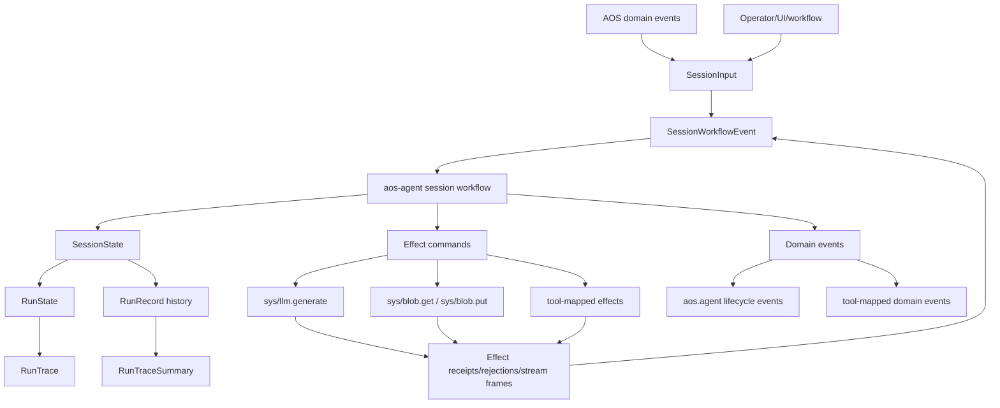
```mermaid
flowchart TD
  Domain[AOS domain events] --> Input[SessionInput]
  Operator[Operator/UI/workflow] --> Input
  Receipts[Effect receipts/rejections/stream frames] --> Event[SessionWorkflowEvent]
  Input --> Event

  Event --> Workflow[aos-agent session workflow]
  Workflow --> State[SessionState]
  Workflow --> Effects[Effect commands]
  Workflow --> Events[Domain events]

  Effects --> LLM[sys/llm.generate]
  Effects --> Blob[sys/blob.get / sys/blob.put]
  Effects --> ToolEffects[tool-mapped effects]
  Events --> LifecycleEvents[aos.agent lifecycle events]
  Events --> ToolDomainEvents[tool-mapped domain events]

  LLM --> Receipts
  Blob --> Receipts
  ToolEffects --> Receipts

  State --> CurrentRun[RunState]
  State --> RunHistory[RunRecord history]
  CurrentRun --> Trace[RunTrace]
  RunHistory --> TraceSummary[RunTraceSummary]
```

The key point is that all meaningful external progress re-enters through `SessionWorkflowEvent`.

```rust
pub enum SessionWorkflowEvent {
    Input(SessionInput),
    Receipt(EffectReceiptEnvelope),
    ReceiptRejected(EffectReceiptRejected),
    StreamFrame(EffectStreamFrameEnvelope),
    Noop,
}
```

## State Ownership

`SessionState` owns session-level state, and while a run is active it mirrors active execution fields into `current_run: Option<RunState>`.

The mirror is deliberate:

1. workflow code can access current pending effects and tool batches directly on `SessionState`,
2. `RunState` keeps a run-scoped copy for inspection, replay, and trace/debug views,
3. completed runs are compacted into `RunRecord` with `RunTraceSummary`.

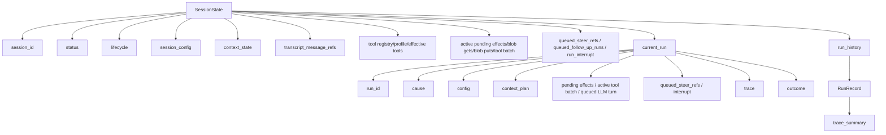
```mermaid
flowchart TD
  SessionState --> Identity[session_id]
  SessionState --> Status[status]
  SessionState --> Lifecycle[lifecycle]
  SessionState --> Config[session_config]
  SessionState --> Context[context_state]
  SessionState --> Transcript[transcript_message_refs]
  SessionState --> Tools[tool registry/profile/effective tools]
  SessionState --> Runtime[active pending effects/blob gets/blob puts/tool batch]
  SessionState --> Intervention[queued_steer_refs / queued_follow_up_runs / run_interrupt]
  SessionState --> CurrentRun[current_run]
  SessionState --> History[run_history]

  CurrentRun --> RunIdentity[run_id]
  CurrentRun --> RunCause[cause]
  CurrentRun --> RunConfig[config]
  CurrentRun --> ContextPlan[context_plan]
  CurrentRun --> RunRuntime[pending effects / active tool batch / queued LLM turn]
  CurrentRun --> RunIntervention[queued_steer_refs / interrupt]
  CurrentRun --> Trace[trace]
  CurrentRun --> Outcome[outcome]

  History --> RunRecord[RunRecord]
  RunRecord --> TraceSummary[trace_summary]
```

Important fields:

```rust
pub struct SessionState {
    pub session_id: SessionId,
    pub status: SessionStatus,
    pub lifecycle: SessionLifecycle,
    pub current_run: Option<RunState>,
    pub run_history: Vec<RunRecord>,
    pub transcript_message_refs: Vec<String>,
    pub pending_llm_turn_refs: Option<Vec<String>>,
    pub active_tool_batch: Option<ActiveToolBatch>,
    pub pending_effects: PendingEffects,
    pub pending_blob_gets: SharedBlobGets<PendingBlobGet>,
    pub pending_blob_puts: SharedBlobPuts<PendingBlobPut>,
    pub effective_tools: EffectiveToolSet,
    pub queued_steer_refs: Vec<String>,
    pub queued_follow_up_runs: Vec<QueuedRunStart>,
    pub run_interrupt: Option<RunInterrupt>,
}
```

```rust
pub struct RunState {
    pub run_id: RunId,
    pub lifecycle: RunLifecycle,
    pub cause: RunCause,
    pub config: RunConfig,
    pub input_refs: Vec<String>,
    pub context_plan: Option<ContextPlan>,
    pub trace: RunTrace,
    pub queued_steer_refs: Vec<String>,
    pub interrupt: Option<RunInterrupt>,
    pub active_tool_batch: Option<ActiveToolBatch>,
    pub pending_llm_turn_refs: Option<Vec<String>>,
    pub last_output_ref: Option<String>,
    pub outcome: Option<RunOutcome>,
}
```

## Workflow Event Loop

The session workflow follows the same pattern for every admitted event:

1. remember previous status/lifecycle/run lifecycle,
2. apply one event deterministically,
3. append trace entries,
4. recompute in-flight runtime work,
5. emit lifecycle/status events if transitions occurred,
6. emit effects/domain events returned by the workflow.

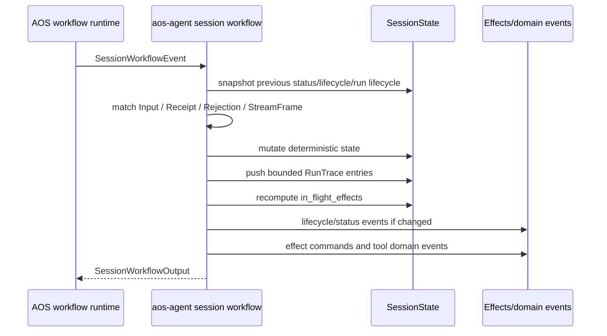
```mermaid
sequenceDiagram
  participant AOS as AOS workflow runtime
  participant R as aos-agent session workflow
  participant S as SessionState
  participant E as Effects/domain events

  AOS->>R: SessionWorkflowEvent
  R->>S: snapshot previous status/lifecycle/run lifecycle
  R->>R: match Input / Receipt / Rejection / StreamFrame
  R->>S: mutate deterministic state
  R->>S: push bounded RunTrace entries
  R->>S: recompute in_flight_effects
  R->>E: lifecycle/status events if changed
  R->>E: effect commands and tool domain events
  R-->>AOS: SessionWorkflowOutput
```

The workflow event envelope is intentionally small:

```json
{
  "$tag": "Input",
  "$value": {
    "session_id": { "0": "session-123" },
    "observed_at_ns": 1710000000000000000,
    "input": {
      "$tag": "RunRequested",
      "$value": {
        "input_ref": "sha256:1111111111111111111111111111111111111111111111111111111111111111",
        "run_overrides": null
      }
    }
  }
}
```

Receipts and stream frames are not special side channels. They are admitted through the same workflow:

```json
{
  "$tag": "Receipt",
  "$value": {
    "effect": "sys/llm.generate@1",
    "params_hash": "sha256:2222222222222222222222222222222222222222222222222222222222222222",
    "issuer_ref": "sha256:3333333333333333333333333333333333333333333333333333333333333333",
    "receipt": {
      "output_ref": "sha256:4444444444444444444444444444444444444444444444444444444444444444",
      "finish_reason": { "reason": "tool_calls", "raw": null },
      "token_usage": { "prompt": 1200, "completion": 180, "total": 1380 },
      "provider_id": "openai"
    }
  }
}
```

## Session Status State Machine

`SessionStatus` is the session availability/control state. It is separate from the run lifecycle.

Only `Open` accepts new runs.

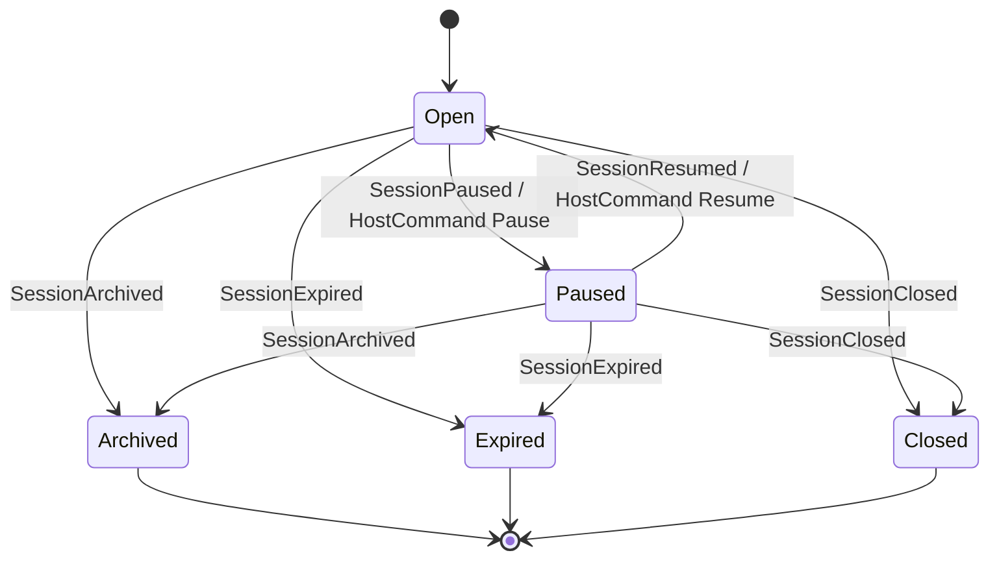
```mermaid
stateDiagram-v2
  [*] --> Open

  Open --> Paused: SessionPaused / HostCommand Pause
  Paused --> Open: SessionResumed / HostCommand Resume

  Open --> Archived: SessionArchived
  Paused --> Archived: SessionArchived
  Archived --> [*]

  Open --> Expired: SessionExpired
  Paused --> Expired: SessionExpired
  Expired --> [*]

  Open --> Closed: SessionClosed
  Paused --> Closed: SessionClosed
  Closed --> [*]
```

Status answers: "Can this session accept new work?"

Lifecycle answers: "What is the current run-level activity state?"

## Session Lifecycle State Machine

`SessionLifecycle` tracks the current run-shaped activity of the session.

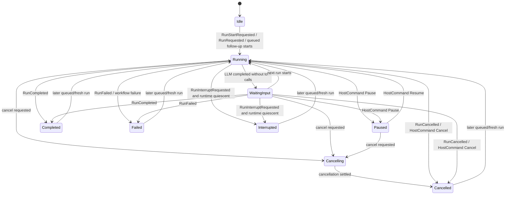
```mermaid
stateDiagram-v2
  [*] --> Idle

  Idle --> Running: RunStartRequested / RunRequested / queued follow-up starts

  Running --> WaitingInput: LLM completed without tool calls
  WaitingInput --> Running: next run starts

  Running --> Paused: HostCommand Pause
  WaitingInput --> Paused: HostCommand Pause
  Paused --> Running: HostCommand Resume

  Running --> Cancelling: cancel requested
  WaitingInput --> Cancelling: cancel requested
  Paused --> Cancelling: cancel requested
  Cancelling --> Cancelled: cancellation settled

  Running --> Completed: RunCompleted
  WaitingInput --> Completed: RunCompleted

  Running --> Failed: RunFailed / workflow failure
  WaitingInput --> Failed: RunFailed

  Running --> Cancelled: RunCancelled / HostCommand Cancel
  WaitingInput --> Cancelled: RunCancelled / HostCommand Cancel

  Running --> Interrupted: RunInterruptRequested and runtime quiescent
  WaitingInput --> Interrupted: RunInterruptRequested and runtime quiescent

  Completed --> Running: later queued/fresh run
  Failed --> Running: later queued/fresh run
  Cancelled --> Running: later queued/fresh run
  Interrupted --> Running: later queued/fresh run
```

Terminal lifecycle states are terminal for the current run, not necessarily for the session forever. A later run may move the session back to `Running` if `SessionStatus` still accepts new runs.

Relevant event emitted on transition:

```rust
pub struct SessionLifecycleChanged {
    pub session_id: SessionId,
    pub observed_at_ns: u64,
    pub from: SessionLifecycle,
    pub to: SessionLifecycle,
    pub run_id: Option<RunId>,
    pub output_ref: Option<String>,
    pub in_flight_effects: u64,
}
```

Example:

```json
{
  "session_id": { "0": "session-123" },
  "observed_at_ns": 1710000000000000100,
  "from": { "$tag": "Running" },
  "to": { "$tag": "WaitingInput" },
  "run_id": {
    "session_id": { "0": "session-123" },
    "run_seq": 1
  },
  "output_ref": "sha256:4444444444444444444444444444444444444444444444444444444444444444",
  "in_flight_effects": 0
}
```

## Run Lifecycle State Machine

`RunLifecycle` is scoped to one run.

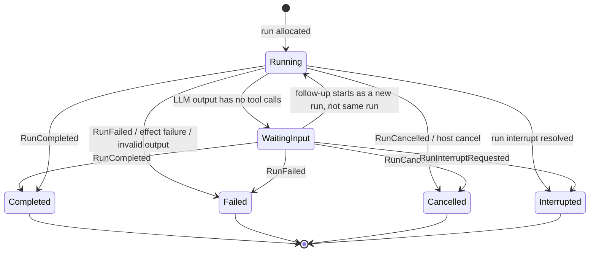
```mermaid
stateDiagram-v2
  [*] --> Running: run allocated

  Running --> WaitingInput: LLM output has no tool calls
  WaitingInput --> Completed: RunCompleted

  Running --> Completed: RunCompleted
  Running --> Failed: RunFailed / effect failure / invalid output
  Running --> Cancelled: RunCancelled / host cancel
  Running --> Interrupted: run interrupt resolved

  WaitingInput --> Running: follow-up starts as a new run, not same run
  WaitingInput --> Failed: RunFailed
  WaitingInput --> Cancelled: RunCancelled
  WaitingInput --> Interrupted: RunInterruptRequested

  Completed --> [*]
  Failed --> [*]
  Cancelled --> [*]
  Interrupted --> [*]
```

The `Queued` variant exists in the contract, but the current workflow allocates a run when it starts. Follow-up work waiting behind an active run is represented as `QueuedRunStart`, not as a `RunState` with `Queued` lifecycle.

Completed run history:

```rust
pub struct RunRecord {
    pub run_id: RunId,
    pub lifecycle: RunLifecycle,
    pub cause: RunCause,
    pub input_refs: Vec<String>,
    pub outcome: Option<RunOutcome>,
    pub trace_summary: RunTraceSummary,
    pub started_at: u64,
    pub ended_at: u64,
}
```

Outcome examples:

```json
{
  "output_ref": "sha256:4444444444444444444444444444444444444444444444444444444444444444",
  "failure": null,
  "cancelled_reason": null,
  "interrupted_reason_ref": null
}
```

```json
{
  "output_ref": null,
  "failure": {
    "code": "llm_output_decode_failed",
    "detail": "LLM output envelope was not valid JSON"
  },
  "cancelled_reason": null,
  "interrupted_reason_ref": null
}
```

```json
{
  "output_ref": null,
  "failure": null,
  "cancelled_reason": null,
  "interrupted_reason_ref": "sha256:5555555555555555555555555555555555555555555555555555555555555555"
}
```

## Starting Runs

There are two run-start input shapes:

1. `RunRequested`: convenience input with one user message ref.
2. `RunStartRequested`: full cause/provenance shape.

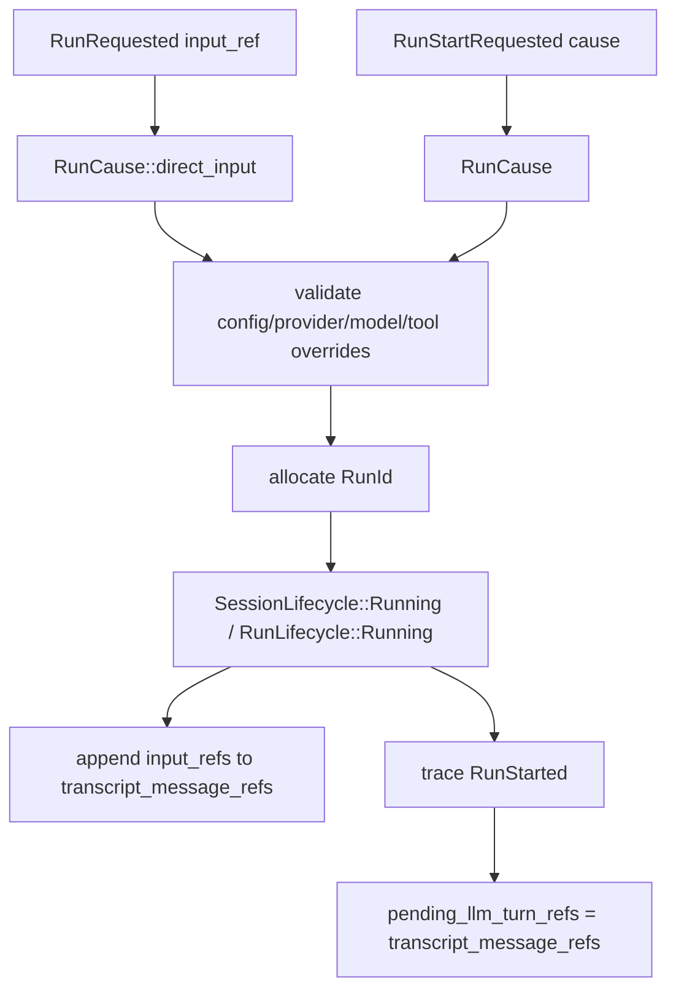
```mermaid
flowchart TD
  RunRequested[RunRequested input_ref] --> DirectCause[RunCause::direct_input]
  RunStartRequested[RunStartRequested cause] --> Cause[RunCause]
  DirectCause --> Validate[validate config/provider/model/tool overrides]
  Cause --> Validate
  Validate --> Allocate[allocate RunId]
  Allocate --> Running[SessionLifecycle::Running / RunLifecycle::Running]
  Running --> Transcript[append input_refs to transcript_message_refs]
  Running --> TraceStart[trace RunStarted]
  TraceStart --> QueueLLM[pending_llm_turn_refs = transcript_message_refs]
```

The full cause object is the key open-ended primitive. It avoids hard-coding "chat" or "software factory" into the SDK.

```rust
pub struct RunCause {
    pub kind: String,
    pub origin: RunCauseOrigin,
    pub input_refs: Vec<String>,
    pub payload_schema: Option<String>,
    pub payload_ref: Option<String>,
    pub subject_refs: Vec<CauseRef>,
}
```

Example direct user input:

```json
{
  "kind": "aos.agent/user_input",
  "origin": {
    "$tag": "DirectIngress",
    "$value": {
      "source": "aos.agent/RunRequested",
      "request_ref": null
    }
  },
  "input_refs": [
    "sha256:1111111111111111111111111111111111111111111111111111111111111111"
  ],
  "payload_schema": null,
  "payload_ref": null,
  "subject_refs": []
}
```

Example domain event cause:

```json
{
  "kind": "demo/triage_alert",
  "origin": {
    "$tag": "DomainEvent",
    "$value": {
      "schema": "demo/AlertRaised@1",
      "event_ref": "sha256:aaaaaaaaaaaaaaaaaaaaaaaaaaaaaaaaaaaaaaaaaaaaaaaaaaaaaaaaaaaaaaaa",
      "key": "alert-42"
    }
  },
  "input_refs": [
    "sha256:bbbbbbbbbbbbbbbbbbbbbbbbbbbbbbbbbbbbbbbbbbbbbbbbbbbbbbbbbbbbbbbb"
  ],
  "payload_schema": "demo/AlertRaised@1",
  "payload_ref": "sha256:aaaaaaaaaaaaaaaaaaaaaaaaaaaaaaaaaaaaaaaaaaaaaaaaaaaaaaaaaaaaaaaa",
  "subject_refs": [
    {
      "kind": "demo/alert",
      "id": "alert-42",
      "ref_": "sha256:aaaaaaaaaaaaaaaaaaaaaaaaaaaaaaaaaaaaaaaaaaaaaaaaaaaaaaaaaaaaaaaa"
    }
  ]
}
```

## Config Selection

`SessionConfig` holds defaults. `RunConfig` is the selected per-run config.

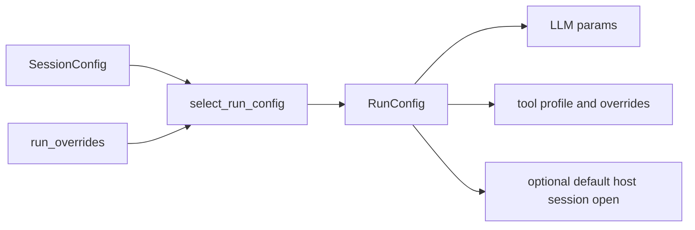
```mermaid
flowchart LR
  SessionConfig --> Select[select_run_config]
  RunOverrides[run_overrides] --> Select
  Select --> RunConfig
  RunConfig --> LLM[LLM params]
  RunConfig --> Tools[tool profile and overrides]
  RunConfig --> HostOpen[optional default host session open]
```

Session default:

```json
{
  "provider": "openai",
  "model": "gpt-5.2",
  "reasoning_effort": { "$tag": "Medium" },
  "max_tokens": 1200,
  "default_prompt_refs": [
    "sha256:0101010101010101010101010101010101010101010101010101010101010101"
  ],
  "default_tool_profile": "local_coding",
  "default_tool_enable": null,
  "default_tool_disable": null,
  "default_tool_force": null,
  "default_host_session_open": {
    "target": {
      "$tag": "Local",
      "$value": {
        "mounts": null,
        "workdir": "/repo",
        "env": null,
        "network_mode": "none"
      }
    },
    "session_ttl_ns": null,
    "labels": null
  }
}
```

Selected run config:

```json
{
  "provider": "openai",
  "model": "gpt-5.2",
  "reasoning_effort": { "$tag": "Medium" },
  "max_tokens": 1200,
  "prompt_refs": [
    "sha256:0101010101010101010101010101010101010101010101010101010101010101"
  ],
  "tool_profile": "local_coding",
  "tool_enable": null,
  "tool_disable": null,
  "tool_force": null,
  "host_session_open": null
}
```

## Context Planning

The context engine selects which refs become the next LLM message list.

Sources include:

1. run prompt refs,
2. transcript refs,
3. run input refs,
4. pinned context inputs,
5. summaries,
6. domain/workspace/memory/skill refs supplied by embedding workflows.

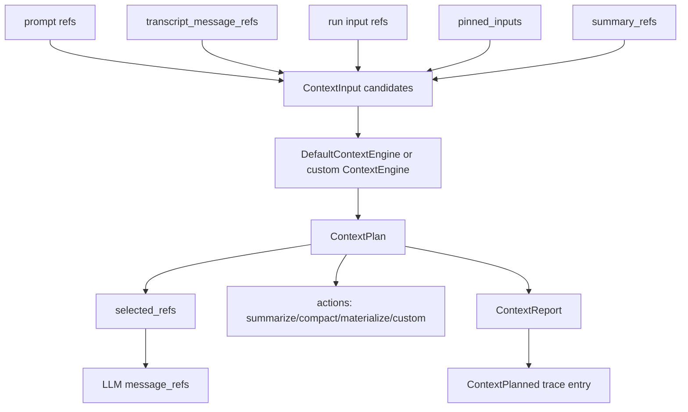
```mermaid
flowchart TD
  PromptRefs[prompt refs] --> Inputs[ContextInput candidates]
  Transcript[transcript_message_refs] --> Inputs
  RunInput[run input refs] --> Inputs
  Pinned[pinned_inputs] --> Inputs
  Summaries[summary_refs] --> Inputs

  Inputs --> Engine[DefaultContextEngine or custom ContextEngine]
  Engine --> Plan[ContextPlan]
  Plan --> Selected[selected_refs]
  Plan --> Actions[actions: summarize/compact/materialize/custom]
  Plan --> Report[ContextReport]
  Selected --> LLM[LLM message_refs]
  Report --> Trace[ContextPlanned trace entry]
```

Context plan:

```rust
pub struct ContextPlan {
    pub selected_refs: Vec<String>,
    pub selections: Vec<ContextSelection>,
    pub actions: Vec<ContextAction>,
    pub report: ContextReport,
}
```

Example:

```json
{
  "selected_refs": [
    "sha256:0101010101010101010101010101010101010101010101010101010101010101",
    "sha256:1111111111111111111111111111111111111111111111111111111111111111"
  ],
  "selections": [
    {
      "input_id": "prompt:0",
      "selected": true,
      "reason": "required prompt",
      "content_ref": "sha256:0101010101010101010101010101010101010101010101010101010101010101"
    },
    {
      "input_id": "turn:0",
      "selected": true,
      "reason": "recent transcript",
      "content_ref": "sha256:1111111111111111111111111111111111111111111111111111111111111111"
    }
  ],
  "actions": [],
  "report": {
    "engine": "aos.agent/default-context",
    "selected_count": 2,
    "dropped_count": 0,
    "budget": {
      "max_refs": null,
      "reserve_output_tokens": 1200
    },
    "decisions": [],
    "unresolved": [],
    "compaction_recommended": false,
    "compaction_required": false
  }
}
```

## LLM Turn State Machine

An LLM turn is a queued intent inside an active run. It is dispatched only when the workflow has no conflicting runtime work.

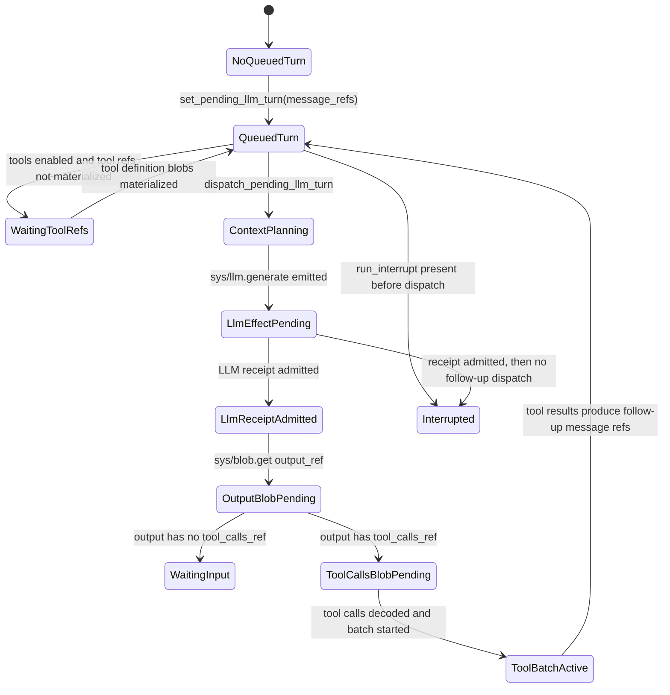
```mermaid
stateDiagram-v2
  [*] --> NoQueuedTurn

  NoQueuedTurn --> QueuedTurn: set_pending_llm_turn(message_refs)
  QueuedTurn --> WaitingToolRefs: tools enabled and tool refs not materialized
  WaitingToolRefs --> QueuedTurn: tool definition blobs materialized

  QueuedTurn --> ContextPlanning: dispatch_pending_llm_turn
  ContextPlanning --> LlmEffectPending: sys/llm.generate emitted
  LlmEffectPending --> LlmReceiptAdmitted: LLM receipt admitted
  LlmReceiptAdmitted --> OutputBlobPending: sys/blob.get output_ref
  OutputBlobPending --> WaitingInput: output has no tool_calls_ref
  OutputBlobPending --> ToolCallsBlobPending: output has tool_calls_ref
  ToolCallsBlobPending --> ToolBatchActive: tool calls decoded and batch started
  ToolBatchActive --> QueuedTurn: tool results produce follow-up message refs

  QueuedTurn --> Interrupted: run_interrupt present before dispatch
  LlmEffectPending --> Interrupted: receipt admitted, then no follow-up dispatch
```

Dispatch guards:

1. there must be an active run,
2. `pending_llm_turn_refs` must be present,
3. no interrupt may be pending,
4. pending effects/blob gets/blob puts must be empty,
5. no active unsettled tool batch may exist,
6. tool definitions must be materialized if tools are enabled.

LLM step before mapping:

```rust
pub struct LlmStepContext {
    pub correlation_id: Option<String>,
    pub message_refs: Vec<String>,
    pub temperature: Option<String>,
    pub top_p: Option<String>,
    pub tool_refs: Option<Vec<String>>,
    pub tool_choice: Option<LlmToolChoice>,
    pub stop_sequences: Option<Vec<String>>,
    pub metadata: Option<BTreeMap<String, String>>,
    pub provider_options_ref: Option<String>,
    pub response_format_ref: Option<String>,
    pub api_key: Option<TextOrSecretRef>,
}
```

Effect params sent to `sys/llm.generate@1`:

```json
{
  "correlation_id": "session-123/run/1/llm/1",
  "provider": "openai",
  "model": "gpt-5.2",
  "message_refs": [
    "sha256:0101010101010101010101010101010101010101010101010101010101010101",
    "sha256:1111111111111111111111111111111111111111111111111111111111111111"
  ],
  "runtime": {
    "temperature": null,
    "top_p": null,
    "max_tokens": 1200,
    "tool_refs": [
      "sha256:2222222222222222222222222222222222222222222222222222222222222222"
    ],
    "tool_choice": null,
    "reasoning_effort": "medium",
    "stop_sequences": null,
    "metadata": {
      "session_id": "session-123",
      "run_seq": "1"
    },
    "provider_options_ref": null,
    "response_format_ref": null
  },
  "api_key": {
    "$tag": "SecretRef",
    "$value": "openai"
  }
}
```

LLM receipt:

```json
{
  "output_ref": "sha256:4444444444444444444444444444444444444444444444444444444444444444",
  "raw_output_ref": null,
  "provider_response_id": "resp_123",
  "finish_reason": {
    "reason": "tool_calls",
    "raw": null
  },
  "token_usage": {
    "prompt": 1200,
    "completion": 180,
    "total": 1380
  },
  "usage_details": {
    "reasoning_tokens": 20,
    "cache_read_tokens": null,
    "cache_write_tokens": null
  },
  "warnings_ref": null,
  "rate_limit_ref": null,
  "cost_cents": null,
  "provider_id": "openai"
}
```

The receipt points to an output blob:

```json
{
  "assistant_text": "I will inspect the workspace and then apply the change.",
  "tool_calls_ref": "sha256:6666666666666666666666666666666666666666666666666666666666666666",
  "reasoning_ref": "sha256:7777777777777777777777777777777777777777777777777777777777777777"
}
```

If `tool_calls_ref` is absent, the run enters `WaitingInput`.

If `tool_calls_ref` is present, the workflow fetches the tool call list blob and starts a tool batch.

## Tool Availability and Effective Tool Set

Tools are selected from:

1. registry,
2. profile,
3. availability rules,
4. run/session enable-disable-force overrides,
5. host session readiness.

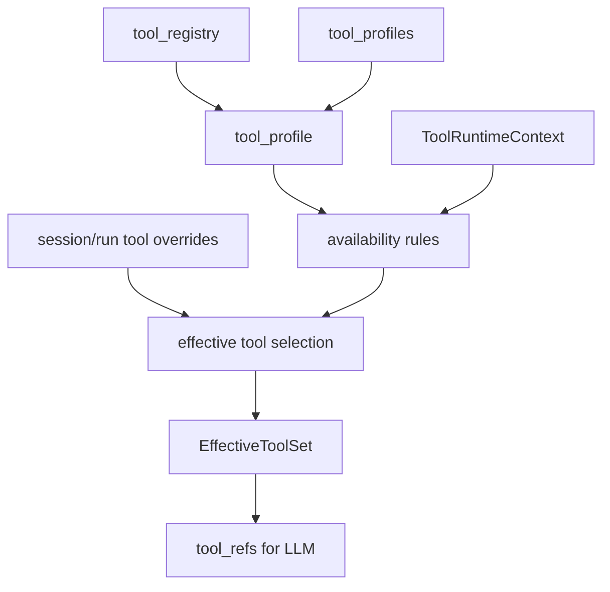
```mermaid
flowchart TD
  Registry[tool_registry] --> Profile[tool_profile]
  Profiles[tool_profiles] --> Profile
  Profile --> Rules[availability rules]
  Runtime[ToolRuntimeContext] --> Rules
  Overrides[session/run tool overrides] --> Select[effective tool selection]
  Rules --> Select
  Select --> Effective[EffectiveToolSet]
  Effective --> ToolRefs[tool_refs for LLM]
```

Tool spec:

```rust
pub struct ToolSpec {
    pub tool_id: String,
    pub tool_name: String,
    pub tool_ref: String,
    pub description: String,
    pub args_schema_json: String,
    pub mapper: ToolMapper,
    pub executor: ToolExecutor,
    pub availability_rules: Vec<ToolAvailabilityRule>,
    pub parallelism_hint: ToolParallelismHint,
}
```

Example:

```json
{
  "tool_id": "host.fs.read_file",
  "tool_name": "read_file",
  "tool_ref": "sha256:2222222222222222222222222222222222222222222222222222222222222222",
  "description": "Read a UTF-8 file from the active host session.",
  "args_schema_json": "{\"type\":\"object\",\"properties\":{\"path\":{\"type\":\"string\"}},\"required\":[\"path\"]}",
  "mapper": { "$tag": "HostFsReadFile" },
  "executor": {
    "$tag": "Effect",
    "$value": {
      "effect": "sys/host.fs.read_file@1"
    }
  },
  "availability_rules": [
    { "$tag": "HostSessionReady" }
  ],
  "parallelism_hint": {
    "parallel_safe": true,
    "resource_key": null
  }
}
```

Effective tool:

```json
{
  "profile_id": "local_coding",
  "profile_requires_host_session": true,
  "ordered_tools": [
    {
      "tool_id": "host.fs.read_file",
      "tool_name": "read_file",
      "tool_ref": "sha256:2222222222222222222222222222222222222222222222222222222222222222",
      "description": "Read a UTF-8 file from the active host session.",
      "args_schema_json": "{\"type\":\"object\"}",
      "mapper": { "$tag": "HostFsReadFile" },
      "executor": {
        "$tag": "Effect",
        "$value": {
          "effect": "sys/host.fs.read_file@1"
        }
      },
      "parallel_safe": true,
      "resource_key": null
    }
  ]
}
```

## Tool Batch State Machine

A tool batch starts when the LLM output contains tool calls.

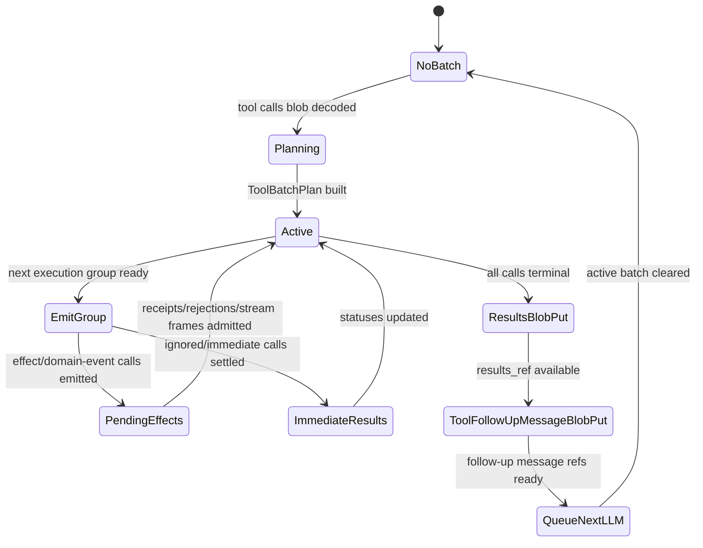
```mermaid
stateDiagram-v2
  [*] --> NoBatch

  NoBatch --> Planning: tool calls blob decoded
  Planning --> Active: ToolBatchPlan built

  Active --> EmitGroup: next execution group ready
  EmitGroup --> PendingEffects: effect/domain-event calls emitted
  EmitGroup --> ImmediateResults: ignored/immediate calls settled

  PendingEffects --> Active: receipts/rejections/stream frames admitted
  ImmediateResults --> Active: statuses updated

  Active --> ResultsBlobPut: all calls terminal
  ResultsBlobPut --> ToolFollowUpMessageBlobPut: results_ref available
  ToolFollowUpMessageBlobPut --> QueueNextLLM: follow-up message refs ready
  QueueNextLLM --> NoBatch: active batch cleared
```

Tool call list blob:

```json
[
  {
    "call_id": "call-1",
    "tool_name": "read_file",
    "arguments_json": "{\"path\":\"Cargo.toml\"}",
    "arguments_ref": null,
    "provider_call_id": "provider-call-1"
  },
  {
    "call_id": "call-2",
    "tool_name": "apply_patch",
    "arguments_json": "",
    "arguments_ref": "sha256:8888888888888888888888888888888888888888888888888888888888888888",
    "provider_call_id": "provider-call-2"
  }
]
```

Planned batch:

```rust
pub struct ToolBatchPlan {
    pub observed_calls: Vec<ToolCallObserved>,
    pub planned_calls: Vec<PlannedToolCall>,
    pub execution_plan: ToolExecutionPlan,
}
```

Example:

```json
{
  "observed_calls": [
    {
      "call_id": "call-1",
      "tool_name": "read_file",
      "arguments_json": "{\"path\":\"Cargo.toml\"}",
      "arguments_ref": null,
      "provider_call_id": "provider-call-1"
    }
  ],
  "planned_calls": [
    {
      "call_id": "call-1",
      "tool_id": "host.fs.read_file",
      "tool_name": "read_file",
      "arguments_json": "{\"path\":\"Cargo.toml\"}",
      "arguments_ref": null,
      "provider_call_id": "provider-call-1",
      "mapper": { "$tag": "HostFsReadFile" },
      "executor": {
        "$tag": "Effect",
        "$value": {
          "effect": "sys/host.fs.read_file@1"
        }
      },
      "parallel_safe": true,
      "resource_key": null,
      "accepted": true
    }
  ],
  "execution_plan": {
    "groups": [
      ["call-1"]
    ]
  }
}
```

Active batch:

```rust
pub struct ActiveToolBatch {
    pub tool_batch_id: ToolBatchId,
    pub intent_id: String,
    pub params_hash: Option<String>,
    pub plan: ToolBatchPlan,
    pub call_status: BTreeMap<String, ToolCallStatus>,
    pub pending_effects: PendingEffectSet<String>,
    pub execution: PendingBatch<String>,
    pub llm_results: BTreeMap<String, ToolCallLlmResult>,
    pub results_ref: Option<String>,
}
```

Tool call statuses:

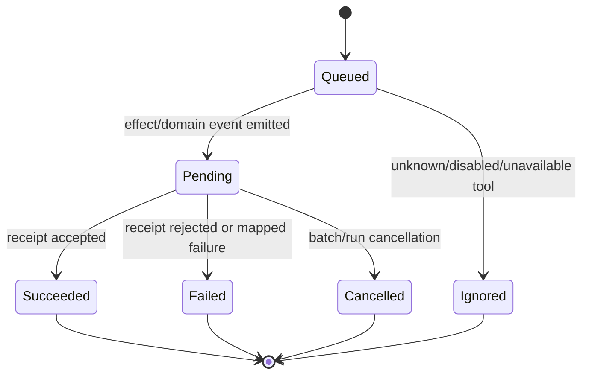
```mermaid
stateDiagram-v2
  [*] --> Queued
  Queued --> Pending: effect/domain event emitted
  Queued --> Ignored: unknown/disabled/unavailable tool
  Pending --> Succeeded: receipt accepted
  Pending --> Failed: receipt rejected or mapped failure
  Pending --> Cancelled: batch/run cancellation
  Succeeded --> [*]
  Failed --> [*]
  Ignored --> [*]
  Cancelled --> [*]
```

Tool result sent back to the next LLM turn:

```json
{
  "call_id": "call-1",
  "tool_id": "host.fs.read_file",
  "tool_name": "read_file",
  "is_error": false,
  "output_json": "{\"contents\":\"[workspace]\\nmembers = [...]\"}"
}
```

## Blob Indirection State Machine

Large payloads stay behind hash refs. The workflow uses blob effects to materialize or store payloads.

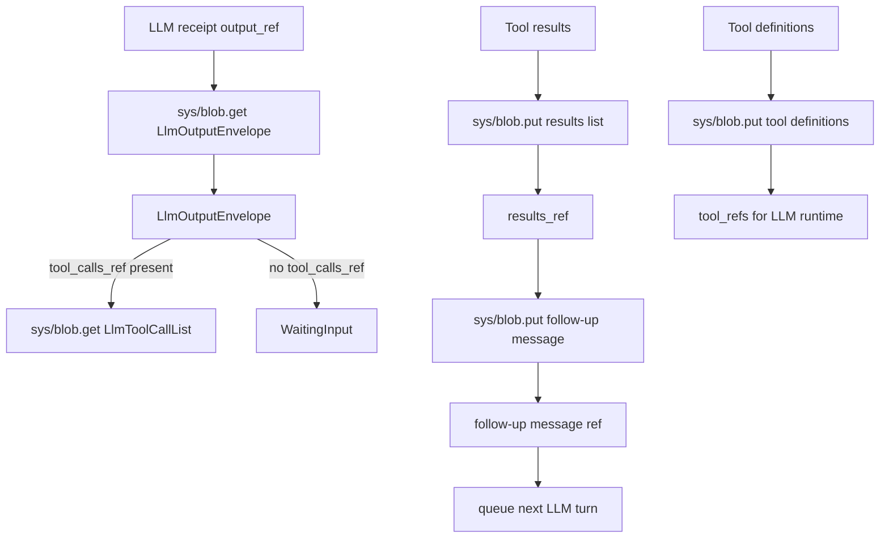
```mermaid
flowchart TD
  LlmReceipt[LLM receipt output_ref] --> BlobGetOutput[sys/blob.get LlmOutputEnvelope]
  BlobGetOutput --> OutputEnvelope[LlmOutputEnvelope]
  OutputEnvelope -->|tool_calls_ref present| BlobGetCalls[sys/blob.get LlmToolCallList]
  OutputEnvelope -->|no tool_calls_ref| WaitingInput[WaitingInput]

  ToolCalls[Tool results] --> BlobPutResults[sys/blob.put results list]
  BlobPutResults --> ResultsRef[results_ref]
  ResultsRef --> BlobPutFollowUp[sys/blob.put follow-up message]
  BlobPutFollowUp --> FollowUpRef[follow-up message ref]
  FollowUpRef --> QueueNext[queue next LLM turn]

  ToolDefs[Tool definitions] --> BlobPutTools[sys/blob.put tool definitions]
  BlobPutTools --> ToolRefs[tool_refs for LLM runtime]
```

Pending blob get kinds:

```rust
pub enum PendingBlobGetKind {
    LlmOutputEnvelope,
    LlmToolCalls,
    ToolCallArguments { tool_batch_id: ToolBatchId, call_id: String },
    ToolResultBlob { tool_batch_id: ToolBatchId, call_id: String, blob_ref: String },
}
```

Pending blob put kinds:

```rust
pub enum PendingBlobPutKind {
    ToolDefinition { tool_id: String },
    ToolFollowUpMessage { index: u64 },
}
```

## Interventions

P7 keeps interventions at the agent/LLM level. Host/Fabric session signaling, especially exec cancellation, belongs to P8.

The ref-based intervention input variants are:

```rust
pub enum SessionInputKind {
    FollowUpInputAppended {
        input_ref: String,
        run_overrides: Option<SessionConfig>,
    },
    RunSteerRequested {
        instruction_ref: String,
    },
    RunInterruptRequested {
        reason_ref: Option<String>,
    },
}
```

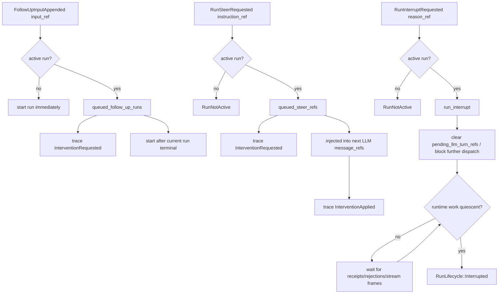
```mermaid
flowchart TD
  FollowUp[FollowUpInputAppended input_ref] --> ActiveCheck{active run?}
  ActiveCheck -->|no| StartNow[start run immediately]
  ActiveCheck -->|yes| QueueFollowUp[queued_follow_up_runs]
  QueueFollowUp --> TraceFollowUp[trace InterventionRequested]
  QueueFollowUp --> Later[start after current run terminal]

  Steer[RunSteerRequested instruction_ref] --> ActiveRun{active run?}
  ActiveRun -->|no| Reject[RunNotActive]
  ActiveRun -->|yes| QueueSteer[queued_steer_refs]
  QueueSteer --> TraceSteer[trace InterventionRequested]
  QueueSteer --> NextLLM[injected into next LLM message_refs]
  NextLLM --> TraceApplied[trace InterventionApplied]

  Interrupt[RunInterruptRequested reason_ref] --> ActiveRun2{active run?}
  ActiveRun2 -->|no| Reject2[RunNotActive]
  ActiveRun2 -->|yes| MarkInterrupt[run_interrupt]
  MarkInterrupt --> BlockDispatch[clear pending_llm_turn_refs / block further dispatch]
  BlockDispatch --> Quiescent{runtime work quiescent?}
  Quiescent -->|no| WaitReceipts[wait for receipts/rejections/stream frames]
  WaitReceipts --> Quiescent
  Quiescent -->|yes| FinishInterrupted[RunLifecycle::Interrupted]
```

Follow-up example:

```json
{
  "$tag": "FollowUpInputAppended",
  "$value": {
    "input_ref": "sha256:9999999999999999999999999999999999999999999999999999999999999999",
    "run_overrides": null
  }
}
```

Queued follow-up:

```json
{
  "cause": {
    "kind": "aos.agent/user_input",
    "origin": {
      "$tag": "DirectIngress",
      "$value": {
        "source": "aos.agent/RunRequested",
        "request_ref": null
      }
    },
    "input_refs": [
      "sha256:9999999999999999999999999999999999999999999999999999999999999999"
    ],
    "payload_schema": null,
    "payload_ref": null,
    "subject_refs": []
  },
  "run_overrides": null,
  "queued_at": 1710000000000000200
}
```

Steer example:

```json
{
  "$tag": "RunSteerRequested",
  "$value": {
    "instruction_ref": "sha256:aaaaaaaaaaaaaaaaaaaaaaaaaaaaaaaaaaaaaaaaaaaaaaaaaaaaaaaaaaaaaaaa"
  }
}
```

If the next planned LLM message refs were:

```json
[
  "sha256:0101010101010101010101010101010101010101010101010101010101010101",
  "sha256:1111111111111111111111111111111111111111111111111111111111111111"
]
```

then the steer instruction is appended to that next turn:

```json
[
  "sha256:0101010101010101010101010101010101010101010101010101010101010101",
  "sha256:1111111111111111111111111111111111111111111111111111111111111111",
  "sha256:aaaaaaaaaaaaaaaaaaaaaaaaaaaaaaaaaaaaaaaaaaaaaaaaaaaaaaaaaaaaaaaa"
]
```

Interrupt example:

```json
{
  "$tag": "RunInterruptRequested",
  "$value": {
    "reason_ref": "sha256:bbbbbbbbbbbbbbbbbbbbbbbbbbbbbbbbbbbbbbbbbbbbbbbbbbbbbbbbbbbbbbbb"
  }
}
```

Stored interrupt:

```json
{
  "reason_ref": "sha256:bbbbbbbbbbbbbbbbbbbbbbbbbbbbbbbbbbbbbbbbbbbbbbbbbbbbbbbbbbbbbbbb",
  "requested_at": 1710000000000000300
}
```

Interrupted outcome:

```json
{
  "output_ref": null,
  "failure": null,
  "cancelled_reason": null,
  "interrupted_reason_ref": "sha256:bbbbbbbbbbbbbbbbbbbbbbbbbbbbbbbbbbbbbbbbbbbbbbbbbbbbbbbbbbbbbbbb"
}
```

Legacy `HostCommandKind::Steer { text }` and `HostCommandKind::FollowUp { text }` are no longer the preferred core shape. They are traced as unsupported legacy text commands because the SDK should queue refs, not raw operator strings.

## Run Traces

Run traces are deterministic state, not debug logs. They are built from admitted input, receipts, rejections, stream frames, and deterministic workflow decisions.

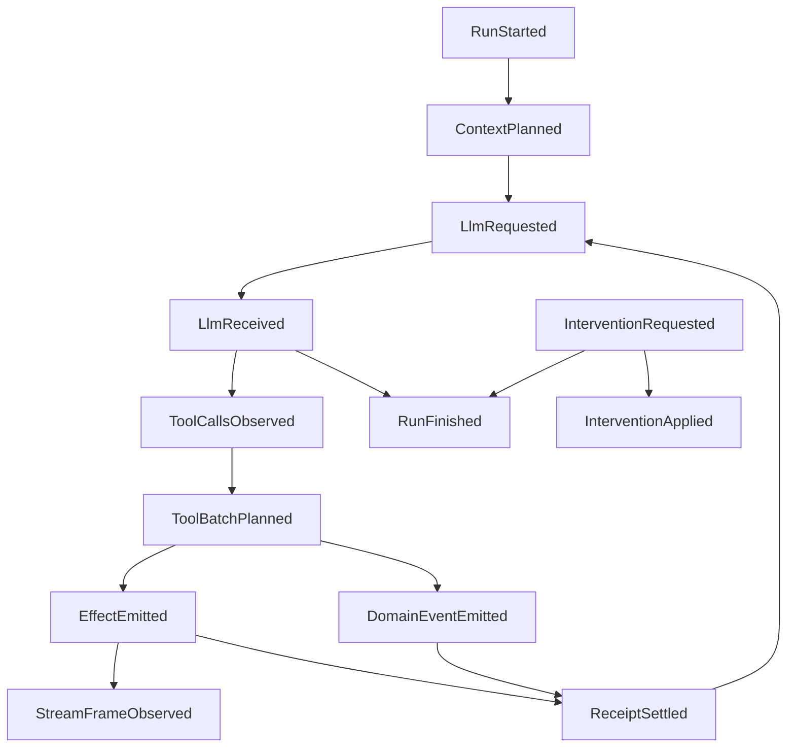
```mermaid
flowchart TD
  RunStarted --> ContextPlanned
  ContextPlanned --> LlmRequested
  LlmRequested --> LlmReceived
  LlmReceived --> ToolCallsObserved
  ToolCallsObserved --> ToolBatchPlanned
  ToolBatchPlanned --> EffectEmitted
  ToolBatchPlanned --> DomainEventEmitted
  EffectEmitted --> StreamFrameObserved
  EffectEmitted --> ReceiptSettled
  DomainEventEmitted --> ReceiptSettled
  ReceiptSettled --> LlmRequested
  LlmReceived --> RunFinished
  InterventionRequested --> InterventionApplied
  InterventionRequested --> RunFinished
```

Trace kind enum:

```rust
pub enum RunTraceEntryKind {
    RunStarted,
    ContextPlanned,
    LlmRequested,
    LlmReceived,
    ToolCallsObserved,
    ToolBatchPlanned,
    EffectEmitted,
    DomainEventEmitted,
    StreamFrameObserved,
    ReceiptSettled,
    InterventionRequested,
    InterventionApplied,
    RunFinished,
    Custom { kind: String },
}
```

Trace entry:

```rust
pub struct RunTraceEntry {
    pub seq: u64,
    pub observed_at_ns: u64,
    pub kind: RunTraceEntryKind,
    pub summary: String,
    pub refs: Vec<RunTraceRef>,
    pub metadata: BTreeMap<String, String>,
}
```

Example trace:

```json
{
  "max_entries": 256,
  "dropped_entries": 0,
  "next_seq": 6,
  "entries": [
    {
      "seq": 0,
      "observed_at_ns": 1710000000000000000,
      "kind": { "$tag": "RunStarted" },
      "summary": "run started",
      "refs": [
        {
          "kind": "input_ref",
          "ref_": "sha256:1111111111111111111111111111111111111111111111111111111111111111",
          "value": null
        }
      ],
      "metadata": {
        "cause_kind": "aos.agent/user_input"
      }
    },
    {
      "seq": 1,
      "observed_at_ns": 1710000000000000000,
      "kind": { "$tag": "ContextPlanned" },
      "summary": "context planned",
      "refs": [
        {
          "kind": "selected_ref",
          "ref_": "sha256:1111111111111111111111111111111111111111111111111111111111111111",
          "value": null
        }
      ],
      "metadata": {
        "engine": "aos.agent/default-context",
        "selected_count": "1",
        "dropped_count": "0"
      }
    },
    {
      "seq": 2,
      "observed_at_ns": 1710000000000000000,
      "kind": { "$tag": "LlmRequested" },
      "summary": "LLM turn requested",
      "refs": [
        {
          "kind": "message_ref",
          "ref_": "sha256:1111111111111111111111111111111111111111111111111111111111111111",
          "value": null
        }
      ],
      "metadata": {
        "provider": "openai",
        "model": "gpt-5.2"
      }
    },
    {
      "seq": 3,
      "observed_at_ns": 1710000000000000100,
      "kind": { "$tag": "LlmReceived" },
      "summary": "LLM receipt admitted",
      "refs": [
        {
          "kind": "output_ref",
          "ref_": "sha256:4444444444444444444444444444444444444444444444444444444444444444",
          "value": null
        }
      ],
      "metadata": {
        "finish_reason": "stop",
        "provider_id": "openai"
      }
    },
    {
      "seq": 4,
      "observed_at_ns": 1710000000000000200,
      "kind": { "$tag": "RunFinished" },
      "summary": "run finished",
      "refs": [
        {
          "kind": "output_ref",
          "ref_": "sha256:4444444444444444444444444444444444444444444444444444444444444444",
          "value": null
        }
      ],
      "metadata": {
        "lifecycle": "Completed"
      }
    }
  ]
}
```

Completed runs retain a summary:

```json
{
  "entry_count": 5,
  "dropped_entries": 0,
  "first_seq": 0,
  "last_seq": 4,
  "last_kind": { "$tag": "RunFinished" },
  "last_summary": "run finished",
  "last_observed_at_ns": 1710000000000000200
}
```

## Host Session Readiness

Host sessions are an edge capability. `aos-agent` tracks enough state to decide whether host-backed tools are available.

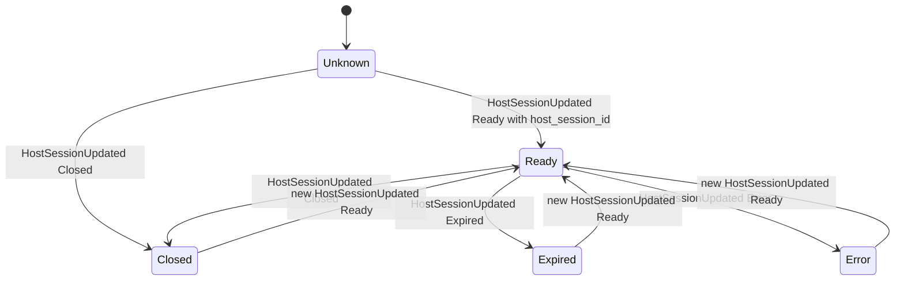
```mermaid
stateDiagram-v2
  [*] --> Unknown
  Unknown --> Ready: HostSessionUpdated Ready with host_session_id
  Unknown --> Closed: HostSessionUpdated Closed
  Ready --> Closed: HostSessionUpdated Closed
  Ready --> Expired: HostSessionUpdated Expired
  Ready --> Error: HostSessionUpdated Error
  Closed --> Ready: new HostSessionUpdated Ready
  Expired --> Ready: new HostSessionUpdated Ready
  Error --> Ready: new HostSessionUpdated Ready
```

Input:

```json
{
  "$tag": "HostSessionUpdated",
  "$value": {
    "host_session_id": "host-session-123",
    "host_session_status": { "$tag": "Ready" }
  }
}
```

Runtime context:

```json
{
  "host_session_id": "host-session-123",
  "host_session_status": { "$tag": "Ready" }
}
```

The tool selector uses this to evaluate `ToolAvailabilityRule::HostSessionReady` and `ToolAvailabilityRule::HostSessionNotReady`.

Host session open config:

```json
{
  "target": {
    "$tag": "Sandbox",
    "$value": {
      "image": "ghcr.io/example/agent:latest",
      "runtime_class": null,
      "workdir": "/workspace",
      "env": {
        "CI": "1"
      },
      "network_mode": "none",
      "mounts": null,
      "cpu_limit_millis": 4000,
      "memory_limit_bytes": 4294967296
    }
  },
  "session_ttl_ns": 3600000000000,
  "labels": {
    "purpose": "coding-agent"
  }
}
```

Host/Fabric signaling is intentionally not part of P7. The agent state now has the run-level interrupt primitive that P8 can connect to host effects, Fabric sessions, exec progress, and receipts.

## End-to-End Example: Direct Chat Run

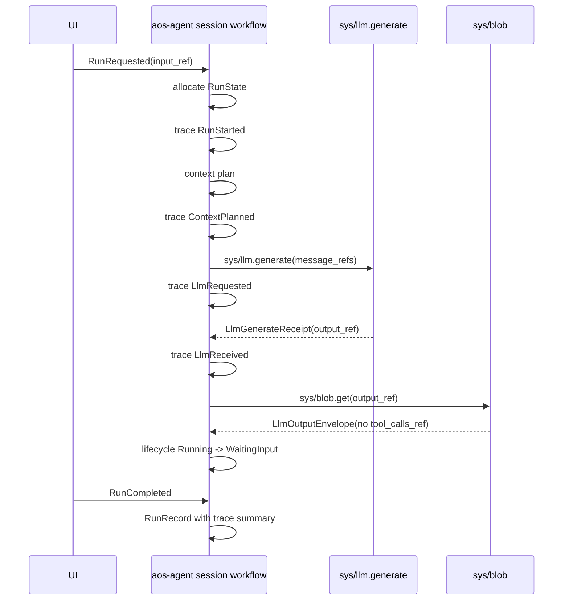
```mermaid
sequenceDiagram
  participant UI
  participant Agent as aos-agent session workflow
  participant LLM as sys/llm.generate
  participant Blob as sys/blob

  UI->>Agent: RunRequested(input_ref)
  Agent->>Agent: allocate RunState
  Agent->>Agent: trace RunStarted
  Agent->>Agent: context plan
  Agent->>Agent: trace ContextPlanned
  Agent->>LLM: sys/llm.generate(message_refs)
  Agent->>Agent: trace LlmRequested
  LLM-->>Agent: LlmGenerateReceipt(output_ref)
  Agent->>Agent: trace LlmReceived
  Agent->>Blob: sys/blob.get(output_ref)
  Blob-->>Agent: LlmOutputEnvelope(no tool_calls_ref)
  Agent->>Agent: lifecycle Running -> WaitingInput
  UI->>Agent: RunCompleted
  Agent->>Agent: RunRecord with trace summary
```

State path:

```text
SessionLifecycle: Idle -> Running -> WaitingInput -> Completed
RunLifecycle:     Running -> WaitingInput -> Completed
SessionStatus:    Open throughout
```

## End-to-End Example: Tool-Using Run

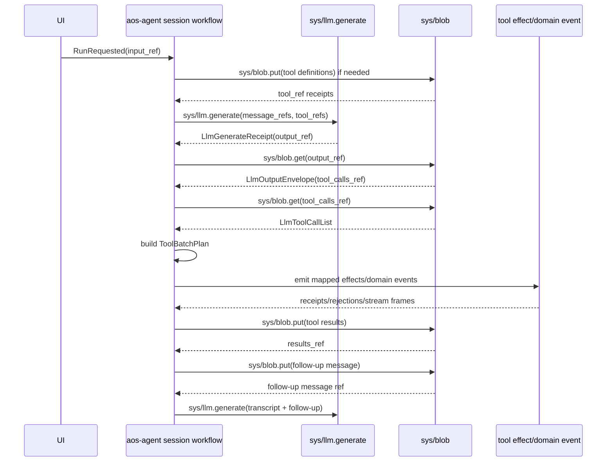
```mermaid
sequenceDiagram
  participant UI
  participant Agent as aos-agent session workflow
  participant LLM as sys/llm.generate
  participant Blob as sys/blob
  participant Tool as tool effect/domain event

  UI->>Agent: RunRequested(input_ref)
  Agent->>Blob: sys/blob.put(tool definitions) if needed
  Blob-->>Agent: tool_ref receipts
  Agent->>LLM: sys/llm.generate(message_refs, tool_refs)
  LLM-->>Agent: LlmGenerateReceipt(output_ref)
  Agent->>Blob: sys/blob.get(output_ref)
  Blob-->>Agent: LlmOutputEnvelope(tool_calls_ref)
  Agent->>Blob: sys/blob.get(tool_calls_ref)
  Blob-->>Agent: LlmToolCallList
  Agent->>Agent: build ToolBatchPlan
  Agent->>Tool: emit mapped effects/domain events
  Tool-->>Agent: receipts/rejections/stream frames
  Agent->>Blob: sys/blob.put(tool results)
  Blob-->>Agent: results_ref
  Agent->>Blob: sys/blob.put(follow-up message)
  Blob-->>Agent: follow-up message ref
  Agent->>LLM: sys/llm.generate(transcript + follow-up)
```

Trace path:

```text
RunStarted
ContextPlanned
LlmRequested
LlmReceived
ToolCallsObserved
ToolBatchPlanned
EffectEmitted / DomainEventEmitted
StreamFrameObserved
ReceiptSettled
LlmRequested
...
RunFinished
```

## End-to-End Example: Steer During Active Run

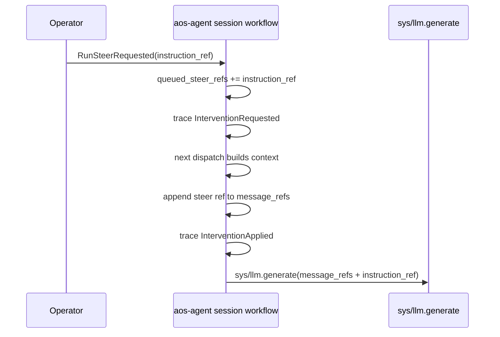
```mermaid
sequenceDiagram
  participant Operator
  participant Agent as aos-agent session workflow
  participant LLM as sys/llm.generate

  Operator->>Agent: RunSteerRequested(instruction_ref)
  Agent->>Agent: queued_steer_refs += instruction_ref
  Agent->>Agent: trace InterventionRequested
  Agent->>Agent: next dispatch builds context
  Agent->>Agent: append steer ref to message_refs
  Agent->>Agent: trace InterventionApplied
  Agent->>LLM: sys/llm.generate(message_refs + instruction_ref)
```

This is not a host/session signal. It is an instruction ref inserted into the next model turn.

## End-to-End Example: Interrupt Before Next LLM Turn

```mermaid
sequenceDiagram
  participant Operator
  participant Agent as aos-agent session workflow
  participant Runtime as effects/receipts

  Operator->>Agent: RunInterruptRequested(reason_ref)
  Agent->>Agent: run_interrupt = Some(...)
  Agent->>Agent: pending_llm_turn_refs = None
  Agent->>Agent: trace InterventionRequested
  Agent->>Agent: check pending effects/blob/tool work
  alt no open runtime work
    Agent->>Agent: RunLifecycle::Interrupted
    Agent->>Agent: SessionLifecycle::Interrupted
    Agent->>Agent: RunOutcome.interrupted_reason_ref = reason_ref
  else open runtime work
    Runtime-->>Agent: receipts/rejections/stream frames admitted
    Agent->>Agent: when quiescent, finish Interrupted
  end
```

The workflow does not claim external work stopped unless admitted runtime state has become quiescent. P8 can add host/Fabric signal effects that attempt to stop external work earlier, but their result must still come back through admitted receipts or stream frames.

## How To Read aos-agent State

For live inspection, the most useful fields are:

1. `status`: whether the session is open, paused, archived, expired, or closed.
2. `lifecycle`: current run-shaped state of the session.
3. `current_run.lifecycle`: active run lifecycle.
4. `current_run.cause`: why the run exists.
5. `transcript_message_refs`: durable session message history.
6. `current_run.context_plan.selected_refs`: what the next/last LLM turn actually saw.
7. `pending_llm_turn_refs`: whether an LLM turn is waiting to dispatch.
8. `active_tool_batch`: current tool execution, statuses, and results.
9. `pending_effects`, `pending_blob_gets`, `pending_blob_puts`: runtime work still open.
10. `queued_steer_refs`, `queued_follow_up_runs`, `run_interrupt`: interventions waiting or applied.
11. `current_run.trace.entries`: active diagnostic trace.
12. `run_history[*].trace_summary`: compact completed run trace summary.

## Mental Model Summary

```mermaid
flowchart TD
  Session[Session] --> Runs[Runs]
  Runs --> Cause[Cause/provenance]
  Runs --> Context[Context plan]
  Runs --> LLM[LLM turns]
  LLM --> Tools[Tool batches]
  Tools --> Effects[Effects/domain events]
  Effects --> Receipts[Receipts/rejections/stream frames]
  Receipts --> Session

  Session --> Interventions[Follow-up / steer / interrupt]
  Interventions --> Runs

  Runs --> Trace[Run trace]
  Trace --> Operators[Operators/tests/evals]
  Trace --> Products[Embedding workflows]
```

The core SDK stays small by making most axes open-ended:

1. `RunCause.kind` and `RunCauseOrigin` describe why a run exists without adding a new API for every product.
2. `ContextInputScope::Custom` and `ContextInputKind::Custom` allow embedding workflows to add context domains.
3. `RunTraceEntryKind::Custom` allows product-specific trace points without changing the core trace contract.
4. `ToolExecutor::{Effect, DomainEvent, HostLoop}` lets tools target AOS effects, native workflows, or host loops.
5. Intervention payloads are refs, so the SDK does not own raw UI text, policy, or host cancellation semantics.

That is the desired boundary: `aos-agent` provides deterministic agent primitives; AOS workflows and adapters compose those primitives into chat agents, long-running agents, self-improving agents, hosted coding agents, and future Fabric-backed execution.
